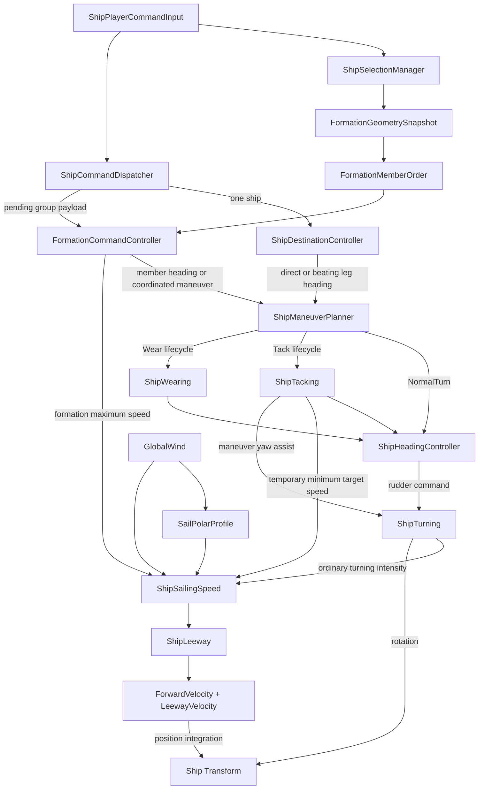

# Ship Movement System Architecture

This document is the canonical architecture record for the ship movement, wind navigation, and formation-command system in the current local working tree. It describes implemented behavior, not an aspirational redesign. It is intended for combat, animation, VFX, audio, AI, UI, refactoring, and debugging work.

Source baseline audited: production C# under `Assets/Assets/Game/Scripts/Sailing`, `Assets/Assets/Game/Scripts/Command`, and `Assets/Assets/Game/Scripts/Camera/PrototypeRTSCameraController.cs`; the movement profile, polar, proxy-prefab, and prototype-scene serialization; and the movement-related EditMode and PlayMode tests under `Assets/Assets/Game/Tests`.

> **Scheduling boundary:** the components which advance input, destination/formation navigation, maneuver ownership, Heading, turning, and speed use ordinary `Update`; the project defines no custom script execution order for them. Selection maintenance and placement-preview rendering use `LateUpdate`. The flows below are causal ownership flows, not a guaranteed within-frame callback order. A control or telemetry change can therefore be observed on the next frame.

## 1. System overview

The system has two command paths which converge on the same per-ship maneuver and physical-motion stack:

- A one-ship command gives a persistent destination to `ShipDestinationController`. That controller selects direct or Assisted beating navigation and asks `ShipManeuverPlanner` for a directed heading change.
- A multi-ship command transfers movement ownership to `FormationCommandController`. It captures geometry and stable order, advances a virtual formation anchor, commands member planners, and writes only each member's formation speed cap. It never directly moves or rotates a ship.

`ShipManeuverPlanner` classifies a directed arc as `NormalTurn`, `Tack`, `Wear`, `Complex`, or `None`. Normal turns are owned by `ShipHeadingController`; Tacks by `ShipTacking`; Wears by `ShipWearing`. The active owner drives the heading controller, which drives `ShipTurning`. `ShipSailingSpeed` composes wind power and external speed authorities, integrates longitudinal speed, adds leeway, and mutates world position. `ShipTurning` is the only production component in this stack that mutates ship rotation.

There is no Rigidbody, NavMesh, CharacterController, collision avoidance, or pathfinding in this path. Motion is direct `Transform` integration.



Formation has its own parallel control path:

```text
selection -> group dispatch -> geometry/order capture -> virtual anchor/navigation
          -> Together or InSuccession maneuver -> Reforming
          -> member heading guidance + member speed caps -> individual ship stack
```

Ownership is deliberately layered. A destination owns navigation intent, a formation owns group guidance, each maneuver owner owns its own completion, and speed authorities are composed rather than writing `CurrentSpeed`. Cancellation removes control intent and caps; it does not rewind or snap physical state.

## 2. Complete production script and class inventory

The inventory contains 24 top-level movement-related class types, two private nested implementation classes, and six additional top-level value/enumeration types. Nested state enums and helper structs are described with their owning class.

### 2.1 Environment, tuning, and physical motion

#### `GlobalWind`

- **Responsibility and authority:** owns the shared wind source values `windFromDegrees` and `windStrength`; computes `WindFromDirection` and the opposite `WindFlowDirection`.
- **Configuration/runtime:** degrees use heading convention 0 = world +Z and 90 = world +X; strength is a scalar; `debugArrowLength` is visualization only.
- **API and relationships:** speed, planner, and destination/formation beating logic read it. Speed passes its Wind Flow vector into the otherwise independent leeway calculation. `GlobalWind` calls no movement owner.
- **Mutation boundary:** it supplies wind data only. It must not own a ship heading, course, maneuver, or velocity.

#### `SailPolarProfile`

- **Responsibility and authority:** ScriptableObject holding `noGoAngle` and the polar-efficiency `AnimationCurve`.
- **API:** `Evaluate(float absoluteRelativeWindAngle)` clamps input to 0..180 degrees and output to 0..1.
- **Callers/callees:** `ShipSailingSpeed` is the runtime consumer. The profile calls only its curve.
- **Mutation boundary:** it defines sail-power lookup data; it does not command speed or declare a maneuver.

#### `ShipMovementProfile`

- **Responsibility and authority:** per-hull tuning asset for base speed, acceleration/deceleration and turn drag time constants, rudder limits/response/reference speed, maximum ordinary yaw rate, and Tack yaw-assist rate.
- **API/state:** public serialized data only; no runtime state machine.
- **Callers/callees:** read by `ShipMovementProfileController`.
- **Mutation boundary:** configuration only; it must not be used as live physical telemetry.

#### `ShipMovementProfileController`

- **Responsibility:** applies a `ShipMovementProfile` during `Awake` and through `ApplyProfile()`.
- **Runtime/configuration:** references the profile, `ShipSailingSpeed`, `ShipTurning`, and `ShipTacking`; exposes only `ApplyProfile`. `profileApplied` and `appliedProfileName` are private diagnostics.
- **Call graph:** calls `ApplyMovementProfile` on all three targets, but only when the profile and all three components are present.
- **Mutation boundary:** may copy tuning into those components. It does not change current speed, position, heading, or active maneuver.

#### `ShipSailingSpeed`

- **Responsibility and authority:** owns wind-relative telemetry, `PolarTargetSpeed`/`AvailableTargetSpeed`, `EffectiveTargetSpeed`, authoritative longitudinal `CurrentSpeed`, the three speed-authority slots, forward/leeway/actual velocity, Course, and final position integration.
- **Configuration:** wind, polar, turning, and leeway references; base maximum speed; acceleration, natural-drag, and full-turn-drag time constants; numerical stop threshold; debug arrow scales.
- **Read API:** `CurrentSpeed`, `PolarTargetSpeed`, `AvailableTargetSpeed`, `GetWindLimitedTargetSpeed()`, `EffectiveTargetSpeed`, formation/Stop cap state and values, `IsPlayerStopped`, `BaseMaxSpeed`, signed/absolute relative wind angle, `PolarEfficiency`, `IsInNoGoZone`, `ForwardVelocity`, `LeewayVelocity`, `ActualVelocity`, `CourseSpeed`, `CourseHeading`, and `HeadingCourseDelta`.
- **Write API and callers:** profile controller calls `ApplyMovementProfile`; Tack calls `Set/ClearManeuverMinimumTargetSpeed`; formation calls `Set/ClearFormationMaximumTargetSpeed`; dispatcher calls `Set/ClearPlayerStopSpeedCap`. `ComposeEffectiveTargetSpeed` is the pure precedence helper.
- **Callees:** reads `GlobalWind`, `SailPolarProfile`, `ShipTurning.TurningIntensity`, and `ShipLeeway`.
- **Mutation boundary:** sole owner of `CurrentSpeed` and sole translator in this system. Other systems must use an authority API, never assign speed or position. It must not rotate the ship.

#### `ShipLeeway`

- **Responsibility:** calculates lateral drift from forward-speed magnitude, absolute wind-relative heading angle, and Wind Flow.
- **Configuration/runtime:** private leeway-angle curve and private calculation telemetry. It has no autonomous `Update`.
- **API and caller:** `CalculateLeewayVelocity(...)`, called by `ShipSailingSpeed`.
- **Mutation boundary:** returns a finite horizontal velocity; it does not move the transform, alter Heading, or alter longitudinal speed.

#### `ShipTurning`

- **Responsibility and authority:** owns the normalized rudder command, physical rudder response, ordinary speed-dependent yaw calculation, temporary maneuver yaw-assist input, and ship rotation.
- **Configuration/runtime:** maximum rudder angle, rudder response in degrees/second, reference speed, maximum ordinary yaw rate; private actual rudder, turn rate/radius, and `isTurning` diagnostics. Only `TurningIntensity` is publicly readable.
- **API and callers:** heading controller calls `SetRudderCommand`; Tack alone currently calls `SetManeuverYawAssistRate` and `ClearManeuverYawAssist`; profile controller calls `ApplyMovementProfile`.
- **Callees:** reads `ShipSailingSpeed.CurrentSpeed`, then calls `transform.Rotate`.
- **Mutation boundary:** sole rotation mutator. It must not choose target headings, classify maneuvers, or own speed. The yaw-assist methods are public but architecturally reserved for the active maneuver owner.

### 2.2 Individual navigation and maneuver ownership

#### `ShipHeadingController`

- **Responsibility and authority:** owns one active directed heading arc and converts remaining arc into a signed rudder command.
- **Configuration/runtime:** `rudderEaseAngle`, `headingTolerance`; target/current heading, forced direction, commanded/accumulated/remaining arc, rudder output, and actual shortest heading error.
- **API:** public `IsActive`, `TargetHeading`, `SetTargetHeading(...)`, and `CancelHeadingCommand()`; assembly-internal `RetargetActiveHeading(...)`.
- **Callers/callees:** planner starts/cancels it; Tack and Wear start/cancel it; planner's internal re-target route invokes its internal re-target; it calls `ShipTurning.SetRudderCommand`.
- **Mutation boundary:** owns heading-control intent and rudder output, not transform rotation. It must not decide whether an arc is a Tack or Wear.

#### `ShipTacking`

- **Responsibility and authority:** owns Tack lifecycle and its completion/failure decision.
- **Configuration/runtime:** Tack yaw-assist rate, minimum target-speed floor, low-speed threshold/delay, exit wind angle, wind-cross dead zone; private `TackState`, target/direction, wind-side/crossing, speed, timing, and assist diagnostics.
- **API:** `IsActive`, `IsCompleted`, `HasFailed`, `StateName`, `ElapsedTime`, `CanStartTack`, `StartTack`, `CancelTack`, and `ApplyMovementProfile`.
- **Callers/callees:** planner owns start/cancel; formation reads completion/failure; it starts/cancels heading, writes the temporary maneuver speed floor, and writes/clears turning yaw assist.
- **Mutation boundary:** may own Tack-specific speed/yaw authority. It does not directly rotate or translate and must not declare formation completion.

#### `ShipWearing`

- **Responsibility and authority:** owns Wear lifecycle, downwind-boundary crossing, completion, and failure.
- **Configuration/runtime:** downwind crossing threshold; private `WearState`, target/direction, signed wind history, crossing, speed, and timing telemetry.
- **API:** `IsActive`, `IsCompleted`, `HasFailed`, `StateName`, `ElapsedTime`, `CanStartWear`, `StartWear`, and `CancelWear`.
- **Callers/callees:** planner starts/cancels it; formation reads completion/failure; it starts/cancels `ShipHeadingController` and reads `ShipSailingSpeed` wind/speed telemetry.
- **Mutation boundary:** no yaw assist and no special speed authority. It does not directly rotate/translate.

#### `ShipManeuverPlanner`

- **Responsibility and authority:** classifies a directed arc, records command identity, dispatches to exactly one maneuver owner, and mirrors that owner's active lifetime.
- **State/configuration:** wind and owner references; `ManeuverType` (`None`, `NormalTurn`, `Tack`, `Wear`, `Complex`); target, direction, arc/boundary diagnostics, `CurrentManeuver`, `IsActive`, and monotonic per-ship `CommandSequence`.
- **API:** classification helpers; `CanExecuteCoordinatedManeuver`; `ExecuteHeadingCommand`; `ExecuteCoordinatedManeuverCommand`; `CancelCurrentManeuver`; assembly-internal `RetargetActiveNormalTurn`.
- **Callers/callees:** destination and formation command it; formation and future read-only consumers query it. It calls heading, Tack, or Wear.
- **Mutation boundary:** owns classification and dispatch, not physical completion for Tack/Wear. `CurrentManeuver` is retained history after natural completion; it must not be treated alone as activity.

#### `ShipDestinationController`

- **Responsibility and authority:** owns one persistent world destination and single-ship navigation mode until arrival, clear, replacement, or an unsupported `Complex` route blocks navigation.
- **Enums/state:** `TurnSelectionMode` = `Auto`, `ForceClockwise`, `ForceCounterClockwise`; `NavigationMode` = `None`, `Direct`, `BeatingUpwind`, `Blocked`. It stores destination, route/corridor/leg data, requested assist mode, and last command diagnostics.
- **Configuration:** arrival radius, heading replan threshold, beating entry/resume thresholds, close-hauled angle, corridor minimum/maximum/ratio/switch factor.
- **API:** `HasDestination`, `CurrentNavigationMode`, `SetDestination(...)`, `ClearDestination()`.
- **Callers/callees:** dispatcher calls it for a single ship; formation clears member destinations when taking ownership. It calls `WindBeatingNavigationMath` and `ShipManeuverPlanner`.
- **Mutation boundary:** may replace/cancel its ship's planner command. It does not write speed, rudder, rotation, or position. Arrival clears navigation and cancels an active maneuver; it does **not** stop the ship.

#### `WindBeatingNavigationMath`

- **Responsibility:** pure horizontal bearing, Wind From angle, beating threshold, close-hauled candidate, directed-choice, route-basis, corridor, cross-track, leg-switch, and heading-direction math.
- **Types/API:** readonly nested `CloseHauledCandidates` and `RouteReference`, plus public static functions used by destination, formation, and tests.
- **Mutation boundary:** no runtime ownership or scene mutation.

#### `TurnDirection`

Top-level command enum: `Clockwise`, `CounterClockwise`. It describes the required directed arc, not merely the sign of the current angular velocity.

#### `WindNavigationAssistMode`

Top-level serialized enum with fixed numeric values `Assisted = 0`, `Direct = 2`, `Manual = 1`. Reordering or renumbering would alter serialized behavior.

### 2.3 Input, selection, dispatch, and preview

#### `ShipSelectionManager`

- **Responsibility and authority:** owns selected membership, deterministic selection order, `PrimarySelectedShip`, optional `DesignatedFormationLead`, and selection-level `RequestedFormationManeuverStyle` intent.
- **Configuration/runtime:** 45-pixel pick radius; selected list, primary, lead, requested style, and pick diagnostics.
- **Nested helper:** private `ScreenSelectionCandidate` pairs a selectable ship with its projected screen position for deterministic box-selection ordering.
- **API:** selection CRUD, box selection, picking, navigation-plane Y, lead set/clear, style toggle, read-only selection properties, and `SelectionMembershipChanged`.
- **Callers/callees:** input mutates it; dispatcher and formation read it. It discovers enabled `ShipDestinationController` instances for screen picking.
- **Mutation boundary:** explicit selection-API membership changes clear designated Lead, reset requested style to `Together`, and raise `SelectionMembershipChanged`. `RefreshSelectionData` can silently prune null/duplicate entries without the notification or style reset; it still clears a Lead which is null, disabled, or no longer selected. Selection never cancels movement, so deselection does not cancel a Stop or command.

#### `ShipCommandDispatcher`

- **Responsibility and authority:** high-level player movement gateway, global monotonic `DispatchSequence`, last dispatch diagnostics, and the single pending group-command payload.
- **State/API:** `DispatchResult`; read-only last/pending fields; `DispatchDestination`, `DispatchFormationPlacement`, `DispatchFormationDestination`, `DispatchStopSelectedShips`, and `ClearPendingGroupCommand`; `DispatchSequenceChanged` event.
- **Callers/callees:** input calls it. It reads selection, gives a single ship its destination, queues group data for formation, clears Stop caps on the dispatch-time selected/snapshot ships, or performs the Stop cancellation sequence.
- **Mutation boundary:** it arbitrates command replacement but does not move ships. The pending group slot is one-shot, not a waypoint queue. Stop is intentionally not a dispatch-sequence increment.

#### `ShipPlayerCommandInput`

- **Responsibility:** converts Input System mouse/keyboard gestures into selection, destination, formation placement/template, style, lead, and Stop operations.
- **Configuration/runtime:** camera and controller references; navigation-plane Y; persisted navigation assist mode; box threshold 8 pixels; right-drag threshold 10 pixels; gesture/preview diagnostics and one-shot `PendingFormationTemplate` (`None`, `LineAhead`).
- **API/call graph:** public template/Stop/style methods; otherwise input callbacks call selection, dispatcher, formation geometry capture, layout generator, and preview renderer.
- **Mutation boundary:** creates command payloads only. It does not directly command rudder, speed, heading, or transforms.

#### `FormationPlacementPreviewRenderer`

- **Responsibility:** presentation-only right-drag ghost rendering from a frozen geometry snapshot.
- **State/API:** owns transient copied materials and mesh matrices; `IsPreviewActive`, `GhostMeshCount`, `ShowPreview`, `UpdatePreviewPose`, `HidePreview`.
- **Nested implementation type:** private `GhostMesh` holds one Mesh/submesh/material draw plus its ship-local matrix/scale, frozen local slot coordinates, and computed world matrix.
- **Callers/callees:** input creates/calls it; it uses `FormationGeometrySnapshot.GetSlotWorldPosition` and `Graphics.DrawMesh`.
- **Mutation boundary:** never changes formation or ship state. Ghost material opacity is 0.35.

#### `PrototypeRTSCameraController`

- **Responsibility:** prototype camera edge pan, middle-drag pan, zoom, and fixed-target focus.
- **Movement relevance:** `Home` focuses its serialized `focusTarget`; it does not focus the selected ship and does not issue a movement command. Static camera math is covered by EditMode tests.
- **Mutation boundary:** changes only the camera transform.

### 2.4 Formation authority and immutable records

#### `FormationCommandController`

- **Responsibility and authority:** owns the active group command, virtual anchor/basis, frozen per-member local-slot copies, stable order/Lead, navigation/Assisted route, requested/effective maneuver style, Together/Succession/Reforming lifecycle, and member formation speed caps.
- **Configuration:** formation beating thresholds/corridor, virtual-heading turn rate, cruise factor, longitudinal control distances, slot deadband, heading threshold, Direct/Manual correction limits, succession lateral tolerance, reformation alignment distance, and arrival radius.
- **Runtime:** `FormationState`, `FormationManeuverState`, `FormationManeuverType`, `FormationNavigationMode`; anchor/bounds/basis/headings/destination; route; maneuver/gate/style; succession list/counts; speed diagnostics; consumed/current dispatch sequences; and private member records.
- **Nested implementation type:** private `FormationMember` holds each captured destination controller, planner, Speed component, frozen local slot, reconstructed world slot, and per-member guidance/speed diagnostics.
- **API:** broad read-only diagnostic surface; `ContainsActiveMember`, `CancelFormation`, `CaptureCurrentFormation`, `TryCaptureSelectedFormationGeometry`, slot reconstruction, and pure longitudinal/reformation helpers.
- **Callers/callees:** subscribes to dispatcher sequence and consumes its group payload; reads selection/wind/snapshot/order/math; clears member destinations; issues member planner commands; writes/clears only formation speed caps.
- **Mutation boundary:** never rotates or translates a member and never assigns `CurrentSpeed`. It owns no individual Tack/Wear completion; it must wait for those owners.

#### `FormationGeometryMember` and `FormationGeometrySnapshot`

- **Responsibility and authority:** immutable capture of `Ship`, `LocalX`, `LocalZ`, formation center/heading/basis, and capture bounds.
- **Construction/API:** `TryCapture`, `CreateFromLocalSlots`, `GetSlotWorldPosition`; readonly member list and properties.
- **Semantics:** input order is preserved; center is the midpoint of projected X/Z bounds, not the member centroid. Forward is the normalized sum of horizontal member forwards, falling back to Primary, first ship, then +Z. World slot is `center + right * LocalX + forward * LocalZ`.
- **Mutation boundary:** snapshot data never follows later member motion.

#### `FormationMemberOrder`

- **Responsibility and authority:** immutable front-to-back order and Formation Lead (`index 0`) for one captured command.
- **Construction/API:** automatic creation, designated-lead creation, explicit ordered constructor, `Count`, `Lead`, `OrderedMembers`, `GetMember`, `IndexOf`.
- **Semantics:** automatic stable sort is descending captured `LocalZ`; differences within 0.001 retain capture order. A valid designated Lead is moved to index 0 while the others keep relative automatic order.
- **Mutation boundary:** no dynamic sorting by current position, speed, identity, or selection Primary.

#### `FormationManeuverStyle`

Top-level intent enum: `Together`, `InSuccession`. Selection owns the requested intent; formation copies it into the active command and resolves an effective style for each maneuver event.

#### `FormationManeuverGate`

- **Responsibility and authority:** immutable event record for succession: flattened `GatePoint`, incoming heading/forward, target heading, direction, planner maneuver type, frozen member order, requested style, frozen formation reference speed, and dispatch sequence.
- **API:** readonly properties and `GetProgress`.
- **Mutation boundary:** event data is not recomputed as the formation turns or reforms.

#### `FormationSuccessionMemberState` and `FormationSuccessionMath`

- **State enum:** `Waiting`, `Maneuvering`, `Completed`.
- **Math responsibility/API:** gate progress, reached/crossed test, predecessor-start eligibility, and next eligible index.
- **Mutation boundary:** pure math; member state storage and transition authority remain in `FormationCommandController`.

#### `FormationSuccessionCompatibility`

- **Responsibility/API:** validates physical column compatibility and resolves `RequestedStyle` to per-event `EffectiveStyle`.
- **Checks:** at least two ordered members, valid horizontal incoming forward, every member within lateral tolerance of Lead, and strict front-to-back physical progress in the frozen order.
- **Mutation boundary:** does not reorder members or change requested style.

#### `FormationLayoutGenerator`

- **Responsibility/API:** pure `CreateStandardLineAhead` builder.
- **Semantics:** preserves supplied order, sets every `LocalX` to zero, spaces adjacent `LocalZ` values by 100 world units, and centers odd/even counts around zero.
- **Mutation boundary:** returns a new snapshot; it does not apply it to ships.

## 3. Authority and ownership matrix

| Concept | Authoritative component/value | Read-only consumers | Lifetime |
|---|---|---|---|
| Player selection | `ShipSelectionManager.SelectedShips` | input, dispatcher, formation capture/UI | Persistent until membership changes |
| Selection Primary | `ShipSelectionManager.PrimarySelectedShip` | geometry forward fallback/UI | Persistent selection metadata |
| Current destination | `ShipDestinationController` | UI/debug, its own navigation | Persistent until arrival/clear/replacement |
| Global command replacement | `ShipCommandDispatcher.DispatchSequence` | formation | Monotonic session value |
| Pending group command | `ShipCommandDispatcher` | formation consumer | Transient one-slot payload |
| Formation command ownership | `FormationCommandController.IsActive/State` | dispatcher Stop, UI/combat | Active command; state history can persist |
| Formation geometry/local slots | capture snapshot, then controller's copied slots | formation, preview, UI | Frozen per command |
| Formation member order | `FormationMemberOrder` | gate, formation, UI/combat | Frozen per command |
| Formation Lead | active order index 0; selection designation is pre-command intent | formation/gate/UI | Frozen command value versus persistent selection intent |
| Requested maneuver style | selection before dispatch; controller copy during command | dispatcher, formation/UI | Persistent selection intent; frozen command copy |
| Effective maneuver style | formation event resolution | succession control/UI | Per-event result; retained diagnostic afterward |
| Formation maneuver state | `FormationCommandController.ManeuverState` | formation logic, UI/animation | Transient state, with `Failed` terminal |
| Succession state | formation's active flag, frozen gate/order, member-state list | formation/UI/animation | Per event; completed list is retained afterward |
| Navigation assist mode | input payload, then destination or formation copy | navigation logic/UI | Persistent per command |
| Single navigation mode | `ShipDestinationController.CurrentNavigationMode` | UI/debug | Transient per destination |
| Formation navigation mode | `FormationCommandController.NavigationMode` | formation/UI | Transient per group command |
| Beating leg | destination or formation route owner | navigation/UI | Transient route state |
| Maneuver classification | `ShipManeuverPlanner.CurrentManeuver` | formation/UI | Current/last classification; pair with `IsActive` |
| NormalTurn lifecycle | `ShipHeadingController.IsActive` | planner, formation | Transient |
| Tack lifecycle | `ShipTacking` | planner, formation, animation | Active then retained Completed/Failed state |
| Wear lifecycle | `ShipWearing` | planner, formation, animation | Active then retained Completed/Failed state |
| Target heading | active owner -> `ShipHeadingController` | planner/formation/UI | Persistent last target; activity is separate |
| Turn direction | planner/heading command | Tack/Wear/formation/UI | Per command; some fields retain history |
| Rudder/yaw application | `ShipTurning` | speed reads ordinary intensity; future adapter | Per frame/command |
| Current longitudinal speed | `ShipSailingSpeed.CurrentSpeed` | turning, leeway, formation, animation/combat | Physical runtime state |
| Available wind-limited speed | `ShipSailingSpeed` polar calculation | formation/UI | Recomputed physical capability |
| Maneuver speed floor | `ShipSailingSpeed`, written by Tack | speed composer | Transient Tack authority |
| Formation speed cap | `ShipSailingSpeed`, written by formation | speed composer/UI | Transient group authority |
| Player Stop cap | `ShipSailingSpeed`, written by dispatcher | speed composer/UI | Persistent until movement command clears it |
| Heading | ship `Transform.forward/eulerAngles.y` | all navigation, UI/combat | Physical state |
| Course | `ShipSailingSpeed.CourseHeading` | UI/animation/combat | Per-frame physical telemetry |
| Leeway | `ShipLeeway` calculation, exposed by speed | speed/animation/combat | Per-frame physical telemetry |
| World velocity | `ShipSailingSpeed.ActualVelocity` | animation/VFX/combat | Per-frame physical telemetry |
| World rotation | ship Transform, mutated by `ShipTurning` | all readers | Physical state |
| World position | ship Transform, mutated by `ShipSailingSpeed` | all readers | Physical state |

## 4. Player input and command flow

Only inputs present in current code are listed.

| Input | Exact input method/semantics | Payload and runtime consumer |
|---|---|---|
| Left click ship | `BeginSelectionGesture` captures Shift; release without an >8 px drag calls `TryPickShip`; non-Shift selects one | `ShipSelectionManager.SelectSingle` |
| Shift + Left click | Toggles the picked ship without replacing the rest | `ToggleSelection` |
| Left-drag box | Drag becomes a box only when distance is strictly >8 px; non-Shift replaces, Shift adds; empty non-Shift clears | `SelectShipsInScreenRect` |
| Right click | Projects mouse-down ray onto selection-average Y (or default plane); command commits on release | `DispatchDestination(destination, mode, assistMode)`; one ship gets a destination, two or more queue a group command |
| Right drag with group | At >10 px, previews frozen mouse-down geometry. Center is mouse-down world point; heading is mouse-down to release | `DispatchFormationPlacement(center, heading, snapshot, mode, assistMode)` |
| C + Right command | C held when the command commits, without V, means `ForceCounterClockwise` | Destination or formation payload |
| V + Right command | V held when the command commits, without C, means `ForceClockwise` | Destination or formation payload |
| C and V together | Resolves to `Auto`, as does neither key | Destination or formation payload |
| L | Toggles one-shot `LineAhead` template only with at least two selected ships | Input/layout/dispatcher; see audit finding for non-drag consumption |
| F | Toggles the currently hovered selected ship as designated Formation Lead; hovering the same Lead clears it | Selection metadata only |
| X | Toggles requested style `Together`/`InSuccession` only with at least two selected ships | Selection intent captured into next group payload |
| S | Clears pending Line Ahead and invokes `DispatchStopSelectedShips` | Stop cancellation and zero speed cap |
| Home | Prototype camera focuses its serialized fixed `focusTarget` | Camera only; no ship command |

`Shift` is captured at left mouse-down. C/V are read when the right command is committed. A right-drag snapshot must still contain active/enabled ships or the gesture is cancelled.

### Command payload and dispatch ownership

For every destination/placement dispatch, the dispatcher first increments `DispatchSequence` and raises `DispatchSequenceChanged`, even if validation later yields no selection. Single-ship dispatch then clears that ship's Stop cap and calls `SetDestination`. A valid group dispatch stores one pending payload: destination, turn selection, assist mode, requested style, optional explicit heading, optional snapshot, member count, and the dispatch sequence. `FormationCommandController` consumes it on a later `Update`. An invalid/no-selection dispatch does not clear an already pending group payload; the higher sequence still makes that older payload stale, but the consumer can briefly consume and then cancel it. See Documentation Audit Finding 12.

Stop is different: it does not increment `DispatchSequence`. With a nonempty selection, it directly cancels an affected active formation, clears the pending group slot, cancels each selected ship's individual navigation/maneuver stack, and sets each selected ship's Stop cap. With no selected ship, the dispatcher returns `NoSelection` before formation or pending-command cleanup; only the input-side one-shot Line Ahead template has already been cleared.

### Latest Command Wins at the command boundary

A newer movement dispatch invalidates an older active formation through the sequence event and a polling backstop. `CancelFormation` clears formation caps, cancels active member planners, clears active formation navigation/maneuver/succession ownership, and leaves position, rotation, and `CurrentSpeed` untouched. A new single destination also calls `SetDestination`, whose reset cancels that ship's previous planner and Assisted route. A new group payload replaces the one pending slot and then captures/starts the new group command.

Selection, designated Lead intent, requested style, physical heading, position, current speed, and wind state are not reset merely because a command is replaced. There is no command queue.

## 5. Navigation modes

`WindNavigationAssistMode` is command policy. It is separate from destination `NavigationMode` and formation `FormationNavigationMode`.

| Behavior | `Assisted` | `Direct` | `Manual` |
|---|---|---|---|
| Persistent destination | Yes | Yes | Yes |
| Automatic single-ship beating | Yes, when target enters threshold | No | No |
| Automatic formation beating/shared leg | Yes | No | No |
| Initial requested/auto turn can be Tack/Wear | Yes | Yes | Yes |
| Single-ship Direct destination guidance | Planner receives desired bearing | Same | Same |
| Formation slot correction outside deadband | Raw slot pursuit normally; bounded to 30 degrees during Reforming | Formation heading ±30 degrees | Formation heading ±12 degrees |
| Later automatic slot correction allowed to create special maneuver | Not explicitly suppressed | Suppressed after initial alignment | Suppressed after initial alignment |
| Automatic recovery/replanning | Direct bearing replans; Assisted route can switch legs/resume direct | Direct bearing/member guidance | Direct bearing/member guidance |
| User owns rudder directly | No | No | No |

`Manual` is therefore not a manual-rudder mode. It still performs destination and formation guidance; its currently implemented distinction is the tighter 12-degree formation slot-correction limit plus the same automatic-special-maneuver suppression used by `Direct`.

Single-ship `NavigationMode` is `None`, `Direct`, `BeatingUpwind`, or `Blocked`. `Blocked` is set when a heading command classifies `Complex`; no alternate path is generated. Formation navigation is only `Direct` or `BeatingUpwind`; an unsupported Complex formation maneuver fails the formation command.

## 6. Wind, polar, and available speed

### Conventions and exact path

- **Heading:** normalized yaw of `transform.forward`; 0 degrees = +Z, 90 = +X.
- **Wind From:** `Quaternion.Euler(0, windFromDegrees, 0) * Vector3.forward`.
- **Wind Flow:** `-WindFromDirection`.
- **True Wind Angle in this implementation:** absolute `Vector3.SignedAngle(ship transform.forward, WindFromDirection, Vector3.up)`, in degrees from 0 through 180.
- **Polar efficiency:** `SailPolarProfile.Evaluate(absAngle)`, clamped 0..1.
- **Available speed:** `max(0, BaseMaxSpeed * polarEfficiency * windStrength)` in world units/second.

`GetWindLimitedTargetSpeed()` performs that calculation live from the current Transform Heading and explicitly clamps the result nonnegative. `AvailableTargetSpeed` aliases the `polarTargetSpeed` value cached during `ShipSailingSpeed.Update`; that cached assignment is the raw product, while the subsequent authority composer clamps its input nonnegative. With the configured nonnegative `windStrength` (`[Min(0)]`), the cached and live values represent the same capability. Formation uses the live method while finding its shared reference capability, avoiding a stale cached member target.

`IsInNoGoZone` is inclusive: `absoluteAngle <= noGoAngle`. It is a maneuver/navigation flag; the speed code does not independently zero polar power in that zone. The current polar asset itself supplies nonzero curve values there.

Heading, not Course, determines wind-relative angle and polar power. Leeway is added only after longitudinal speed is calculated; it changes Course and actual velocity but does not redefine the True Wind Angle.

All headings, wind-relative angles, rudder angles, and yaw rates use degrees (yaw rate is degrees/second). Speeds and velocities use Unity world units/second. Time constants and maneuver timers use seconds. `windStrength`, polar efficiency, cruise factor, and normalized rudder are dimensionless.

## 7. Speed authority stack

`ShipSailingSpeed.ComposeEffectiveTargetSpeed` defines the exact target precedence:

```text
available = max(0, wind/polar target)
if maneuver floor active: effective = max(available, nonnegative floor)
if formation cap active:  effective = min(effective, nonnegative formation cap)
if Player Stop active:    effective = min(effective, nonnegative Stop cap)
```

The final order is therefore:

1. wind/polar available speed;
2. special-maneuver minimum floor;
3. formation maximum cap;
4. Player Stop maximum cap;
5. exponential acceleration/deceleration toward the result;
6. multiplicative ordinary-turn drag on the resulting `CurrentSpeed`.

Formation and Stop can override a Tack floor; Stop at zero always wins. All inputs and outputs are clamped nonnegative, so this stack cannot request reverse motion.

| Value | Meaning |
|---|---|
| `AvailableTargetSpeed` | Cached heading/wind/polar capability from the latest speed update |
| `GetWindLimitedTargetSpeed()` | Fresh calculation of the same capability from current Heading |
| `EffectiveTargetSpeed` | Composed target after floor and caps, before response and turn drag |
| `CurrentSpeed` | Authoritative physical forward speed after response and turn drag |
| Maneuver minimum | Tack-owned floor, active only during `CrossingNoGo` |
| Formation maximum | Formation-owned cap for station keeping or succession sequencing |
| Player Stop cap | Dispatcher-owned cap; zero expresses Stop intent |

Speed response is first-order exponential. For time constant `tau`, the response fraction per frame is `1 - exp(-deltaTime / tau)`. The acceleration time constant is used when the effective target exceeds current speed; otherwise natural-drag time is used. If target is zero and the residual speed falls below 0.03, it is finalized to exactly zero. Ordinary turn drag is then `exp(-TurningIntensity² * deltaTime / fullTurnDragTimeConstant)`. Because `TurningIntensity` excludes Tack yaw assist, the additional assist does not directly add turn drag.

### Formation reference speed and station keeping

Each frame, formation reference speed is:

```text
SharedFormationTargetSpeed =
    min(each non-null captured member with Speed's fresh wind-limited target)
    * FormationCruiseFactor
```

The current cruise factor is 0.9. The controller separately measures the slowest current member speed. Outside Reforming, the virtual anchor speed is the lesser of formation reference speed and slowest current member speed. During Reforming, it is the formation reference speed itself.

For ordinary station keeping:

```text
ForwardError = Dot(slotPosition - shipPosition, formationForward)
```

- Positive error means the ship is behind/lagging its slot. From the +4-unit deadband edge to +40 units, its cap interpolates from reference speed toward its own available speed. At or beyond the full catch-up distance it may use all available wind-limited speed.
- Negative error means the ship is ahead of its slot. From -4 to -40 units, its cap interpolates from reference speed toward zero. It never requests reverse.
- Inside ±4 units, the cap is reference speed.
- Every output is clamped from zero through the member's available speed.

This longitudinal rule is shared by Assisted, Direct, and Manual. It is suspended during Together `Executing`, when all formation caps are cleared. During succession `Executing`, normal station keeping is replaced by frozen gate reference caps: Waiting, Completed, and NormalTurn-maneuvering members are capped to `min(gate reference, current available)`; a member actively Tacking or Wearing has its formation cap cleared so its special maneuver is not throttled.

### Reforming anchor-speed rule

During `FormationManeuverState.Reforming`, the virtual anchor progresses at `SharedFormationTargetSpeed` even if one member is currently slowed. Member station-keeping caps then make ships converge on that moving reference. In every other state, the established normal rule remains `min(reference speed, slowest current member speed)`. This distinction is protected by `AnchorMoveSpeed_ReformingIgnoresSlowedMemberWhileNormalMovementRetainsMinimum`.

## 8. Turning physics

`ShipHeadingController` writes a normalized rudder command in [-1, +1]. `ShipTurning` computes:

```text
targetRudderAngle = rudderCommand * maxRudderAngle
currentRudderAngle = MoveTowards(current, target, rudderResponse * dt)
speedFactor = Clamp01(CurrentSpeed / rudderReferenceSpeed)
ordinaryYawRate = maxTurnRate * (currentRudderAngle / maxRudderAngle) * speedFactor
totalYawRate = ordinaryYawRate + maneuverYawAssistRate
```

It applies `totalYawRate * deltaTime` directly to the ship Transform. Positive rudder/yaw is Clockwise under the project's heading convention; negative is CounterClockwise.

### Ordinary turn authority

Ordinary yaw is continuously scaled by speed. At zero speed it is zero, regardless of rudder angle. `TurningIntensity` is the unsigned ratio of ordinary yaw magnitude to maximum ordinary yaw; it excludes maneuver assist. Speed's turn drag reads this value.

The physical rudder angle does not snap when a command is cancelled. The heading controller commands zero; `ShipTurning` recenters the actual rudder at its configured response rate. This is physical carry-over across command replacement.

### Tack yaw assist

Tack yaw assist is a signed additive yaw rate which is not scaled by speed and is not included in `TurningIntensity`. In current production code only `ShipTacking` calls `SetManeuverYawAssistRate`/`ClearManeuverYawAssist`, and it enables assist only in `CrossingNoGo` while speed is at least the abort threshold. Combat, animation, formation, and AI must not use this low-level interface.

Theoretically, a nonzero assist could rotate a zero-speed ship because it is additive. The current Tack owner prevents that case by clearing assist below its 0.25 speed threshold.

## 9. Ship heading controller state machine

> **Architectural interpretation:** `ShipHeadingController` has no explicit state enum. The following names describe its `isActive` transitions and call outcomes.

| Conceptual state | Entry | Update/authority | Exit |
|---|---|---|---|
| Idle | Initial component state or no command | No rudder writes from active guidance | `SetTargetHeading` |
| Active directed turn | Target outside 0.5-degree tolerance | Accumulates only yaw made in requested direction; commands eased signed rudder | Remaining directed arc <= tolerance, cancel, or replacement |
| Complete | Active arc reaches tolerance | Sets rudder command to zero; no heading snap | Next command |
| Cancelled | `CancelHeadingCommand` | Sets active false and rudder command zero; preserves physical Transform/rudder response | Next command |

`SetTargetHeading(target, direction)` normalizes the target and constructs the full directed arc: Clockwise uses repeat(target-current), CounterClockwise uses repeat(current-target). A forced arc can be almost 360 degrees. However, if the actual shortest target error is already within 0.5 degrees, it completes immediately. Otherwise it resets `previousHeading`, accumulated angle, and remaining angle and begins a new command.

During active updates, opposite-direction yaw contributes zero rather than subtracting from accumulated progress. Rudder magnitude is `Clamp01(remainingArc / rudderEaseAngle)`; current tuning eases through the final 20 degrees. Completion sets remaining arc and rudder output to zero without assigning Transform rotation.

### `RetargetActiveHeading`

This assembly-internal API is valid only while the heading controller is active. It changes the target of the existing directed turn:

- Same direction: accumulated history is retained; commanded arc becomes `accumulated + new directed remaining`.
- Direction reversal: `previousHeading` is re-baselined to current Heading, accumulated progress becomes zero, and commanded arc becomes the new directed remaining arc.
- A new target already within tolerance completes the active command and centers commanded rudder.

`ShipManeuverPlanner.RetargetActiveNormalTurn` guards this API so it is used only for an active planner `NormalTurn`. It updates planner target/direction copies and does not increment `CommandSequence`.

`SetTargetHeading` is not equivalent: it represents a fresh directed command and always resets turn history. Reforming uses in-place retargeting to follow a moving bounded correction target without repeatedly creating new commands or corrupting forced-arc accounting.

## 10. Maneuver planner state machine

`ShipManeuverPlanner.ManeuverType` is exactly `None`, `NormalTurn`, `Tack`, `Wear`, and `Complex`.

### Classification

The planner evaluates the requested full CW/CCW arc. With a valid horizontal Wind From vector and an arc greater than 0.1 degrees:

- crossing the Wind From boundary only -> `Tack`;
- crossing the downwind boundary (`Wind From + 180`) only -> `Wear`;
- crossing both -> `Complex`;
- crossing neither -> `NormalTurn`.

A boundary counts only when strictly inside the arc: its directed distance must be greater than 0.1 and less than `arc - 0.1`. A boundary at an endpoint is not a crossing. A tiny arc or missing/degenerate wind classifies `None`.

### Commands and state

| API/event | Behavior |
|---|---|
| `ExecuteHeadingCommand` | Cancels an active owner, increments `CommandSequence`, classifies, and starts Heading/Tack/Wear. `None` and `Complex` start no owner. |
| `ExecuteCoordinatedManeuverCommand` | Cancels an active owner, increments sequence, accepts the caller-supplied Normal/Tack/Wear type without classifying, and starts that owner. |
| `CanExecuteCoordinatedManeuver` | Separate capability/prevalidation query; Normal requires Heading, Tack requires a startable Tack owner, Wear requires a startable Wear owner. Execute does not call this itself. |
| `RetargetActiveNormalTurn` | Internal, active-Normal-only retarget; no command-sequence increment. |
| `CancelCurrentManeuver` | Cancels the actual current owner and clears planner active/current/classified values to `None`. |

The authoritative active lifetime is type-specific:

```text
NormalTurn -> ShipHeadingController.IsActive
Tack       -> ShipTacking.IsActive
Wear       -> ShipWearing.IsActive
```

The planner mirrors that owner in its own `Update`. It must not treat Heading completion as Tack/Wear completion. `CurrentManeuver` and target fields remain as last-command history after natural completion until cancel/replacement; consumers must guard them with the authoritative owner state.

`Complex` is recognized but unsupported: single-ship destination navigation becomes `Blocked`; formation fails rather than attempting a composite route.

## 11. Tack state machine

`ShipTacking` owns the exact private states `Idle`, `TurningIntoWind`, `CrossingNoGo`, `Recovering`, `Completed`, and `Failed`. The enum is private; current external code reads `StateName` plus the typed booleans.

| State | Entry condition | Update and authority | Exit/next state |
|---|---|---|---|
| `Idle` | Initial or `CancelTack` | No floor or yaw assist | Valid `StartTack` -> `TurningIntoWind` |
| `TurningIntoWind` | Valid refs; starting signed wind angle outside ±1 degree; directed Heading command started | Heading/rudder provides ordinary turn. No Tack floor or assist yet. | `IsInNoGoZone` -> record speed, set floor, `CrossingNoGo` |
| `CrossingNoGo` | No-go entry | Floor active. At speed >=0.25, signed profile yaw assist is active and wind-side crossing is detected. Below 0.25, assist clears and low-speed timer advances. | Low for 1.5 s -> `Failed`; crossed wind and abs angle >=67.5 with positive polar efficiency -> clear floor/assist, `Recovering` |
| `Recovering` | Successful no-go exit | Heading owner continues; no Tack floor/assist | Heading inactive -> `Completed` |
| `Completed` | Authoritative heading recovery completed | `IsCompleted=true`, `IsActive=false`; terminal diagnostic | New start or cancel |
| `Failed` | Missing refs, start inside wind-cross dead zone, or low-speed abort | Clears floor/assist and cancels Heading | New start or cancel |

Start first cancels any active Tack and clears old floor/assist, then snapshots target, direction, starting wind side, speeds, and timers. Missing Speed/Turning/Heading fails before activity. Starting within the ±1-degree wind-cross dead zone also fails and cancels Heading.

The floor is a target-speed floor, not a direct write to `CurrentSpeed`; later formation and Stop caps can still limit it. The yaw assist is additive to ordinary rudder yaw. `CancelTack` clears assist and floor, cancels Heading, returns to `Idle`, and preserves Transform/current speed.

Planner and ordinary/Together formation participation must wait for `ShipTacking.IsActive` to end and, where success matters, `IsCompleted` to become true. Heading becoming inactive is only the final condition inside `Recovering`, not a substitute for Tack ownership during earlier phases. Succession has one explicit runtime exception: a member which becomes unusable after preflight is treated as Completed for that event, as documented in Section 20.

## 12. Wear state machine

`ShipWearing` owns `Idle`, `TurningDownwind`, `CrossingDownwind`, `Recovering`, `Completed`, and `Failed`.

| State | Entry condition | Update and authority | Exit/next state |
|---|---|---|---|
| `Idle` | Initial or cancel | No special speed/yaw authority | `StartWear` -> `TurningDownwind` |
| `TurningDownwind` | Target/direction captured and Heading started | Ordinary Heading/rudder turn; samples wind and speed | abs wind angle >=170 -> `CrossingDownwind`; missing refs or premature Heading end -> `Failed` |
| `CrossingDownwind` | Reaches downwind threshold | Watches signed-angle wrap in required direction | Correct ±180 crossing -> `Recovering`; premature Heading end -> `Failed` |
| `Recovering` | Signed downwind boundary crossed | Continues ordinary Heading turn | Heading inactive -> `Completed` |
| `Completed` | Directed heading arc completes after crossing | `IsCompleted=true`, inactive | New start/cancel |
| `Failed` | Missing owner/ref or heading ends before required crossing | Inactive diagnostic terminal | New start/cancel |

For CounterClockwise Wear, crossing is `previous >= +170` and `current <= -170`. For Clockwise it is `previous <= -170` and `current >= +170`. This explicit signed discontinuity proves that the directed route crossed ±180 rather than merely approaching downwind.

Wear has no maneuver minimum speed and no yaw assist. All yaw comes from `ShipHeadingController` through ordinary speed-scaled rudder authority. `CancelWear` cancels Heading and returns to Idle without changing physical speed or pose. As with Tack, succession can treat a member which becomes unusable after atomic preflight as Completed for that event instead of waiting for its Wear owner.

## 13. Leeway, Heading, and Course

| Quantity | Current source | Meaning and consumers |
|---|---|---|
| Heading | `Transform.forward` / normalized yaw | Bow orientation; navigation, wind angle, guns/arcs, compass, hull visuals |
| `ForwardVelocity` | `transform.forward * CurrentSpeed` | Longitudinal through-water-style component in this model |
| `LeewayVelocity` | `ShipLeeway` result exposed by speed | Instantaneous lateral drift caused by Wind Flow |
| `ActualVelocity` | `ForwardVelocity + LeewayVelocity` | Final world translation velocity; wake, projectile lead, motion VFX |
| `CourseHeading` | Horizontal bearing of `ActualVelocity` | Direction of travel over the world plane; falls back to Heading near zero velocity |
| `CourseSpeed` | Magnitude of `ActualVelocity` | Total world-motion magnitude including leeway |
| `HeadingCourseDelta` | `DeltaAngle(Heading, CourseHeading)` | Signed crab/leeway angle |

Leeway evaluates a private curve from absolute wind angle to leeway angle. Its lateral speed is `abs(CurrentSpeed) * tan(leewayAngle)`. Side is the sign of the dot product between normalized Wind Flow and ship right. Invalid, non-finite, or near-zero inputs return zero. There is no leeway inertia or ocean-current state.

Use Heading for wind/polar calculations, bow aim/orientation, and directed turn classification. Use Course/`ActualVelocity` for wakes, ground-track UI, interception, and projectile lead. Using `transform.forward` as wake direction is wrong whenever leeway is nonzero.

## 14. Single-ship destination flow

1. Right-click commit calls `ShipCommandDispatcher.DispatchDestination` with world destination, Auto/C/V selection, and assist mode.
2. With exactly one selected ship, dispatcher increments the global sequence, clears that ship's Stop cap, and calls `ShipDestinationController.SetDestination`.
3. `SetDestination` cancels the prior active route/owner, stores one destination, and computes horizontal distance and desired bearing.
4. If already inside the 5-unit arrival radius, it immediately clears destination ownership. Otherwise non-Assisted modes issue the desired bearing directly. Assisted either issues direct bearing or builds a route/corridor and selects a close-hauled leg.
5. `ShipManeuverPlanner` classifies the requested directed arc and starts Heading, Tack, or Wear. `Complex` starts nothing and makes destination navigation `Blocked`.
6. Heading/Tack/Wear drives rudder; turning rotates; speed composes its authorities and integrates forward plus leeway velocity.
7. While direct and no maneuver is active, destination replans only when current Heading differs from the continuously recomputed destination bearing by more than 3 degrees. Later replans use Auto direction.
8. Assisted beating switches legs after the active maneuver ends and the ship crosses its dynamic corridor boundary. Its switch count increments when the opposite-leg command is issued; unlike formation beating, there is no Reforming gate.
9. At horizontal distance <=5, destination becomes absent, navigation mode becomes `None`, and an active planner owner is cancelled.

Arrival performs no position snap, heading snap, speed cap, or Stop. The ship continues to sail physically on its current heading at the speed allowed by wind and remaining authorities. A forced C/V direction constrains the initial command; direct replans, route resume, and normal leg switching subsequently resolve Auto as encoded.

A replacement destination invokes the same reset first. It removes old route/maneuver control but preserves position, Heading, `CurrentSpeed`, actual rudder response, wind state, and selection. There is no waypoint queue.

## 15. Formation data model

### Geometry and center

`FormationGeometrySnapshot.TryCapture` removes nulls and duplicates while preserving input order. It calculates a normalized sum of member horizontal forwards. If that sum cancels out, it falls back to selection Primary's horizontal forward, then the first ship's forward, then world +Z.

An average member position is used only as a temporary projection origin. Every member is projected onto formation right/forward to find X/Z extrema; the Formation Center is the midpoint of those projected bounds. Member `LocalX` and `LocalZ` are then recalculated around that bounds-based center. It is therefore not generally the centroid.

```text
FormationRight = Cross(worldUp, FormationForward)
SlotWorld = FormationCenter + FormationRight*LocalX + FormationForward*LocalZ
```

Snapshot members and properties are read-only. On command capture, `FormationCommandController` copies each local slot into its private member record. Those local values are never written again during the command; only world slot positions are rebuilt from the moving anchor and evolving basis.

### Stable order and Formation Lead

Automatic `FormationMemberOrder` is a stable front-to-back sort by descending captured `LocalZ`. Values within 0.001 preserve captured order. It never uses ship speed, current position, entity identity, or selection Primary.

The Formation Lead is order index 0. If selection has a valid designated Lead, `CreateWithDesignatedLead` moves that member to index 0 and preserves the automatic relative order of every other member. This active order is frozen. The Lead is not silently reassigned if positions later change.

Selection Primary and designated Formation Lead are separate concepts:

- Primary is `selectedShips[0]`, used for selection/UI and only as a geometry-heading fallback.
- Designated Lead is optional formation-order intent. Setting it does not change Primary.
- An explicit selection-API membership change clears designation and resets selection requested style to Together. Automatic null/duplicate pruning in `RefreshSelectionData` does not raise the membership event or reset style; see Documentation Audit Finding 15.
- Once a formation command captures its order, later selection changes do not mutate that active order.

### Frozen invariants

- Local slots are not recaptured during Together, succession, or Reforming.
- Order is not rebuilt during a maneuver event.
- Lead is not recomputed from physical position.
- Order never dynamically sorts by speed or position.
- Rebase changes only the virtual anchor: it averages each usable member's implied anchor under the existing frozen slot and current formation basis.

### Line Ahead

`FormationLayoutGenerator` creates a centered line with `LocalX = 0` and adjacent `LocalZ` spacing of 100 world units, retaining the supplied frozen order. A designated Lead is moved to order 0 before generation.

Right-drag placement consumes the generated snapshot through the explicit-heading path. The current non-drag L + Right Click path builds and queues the same snapshot but does not apply it in the formation consumer; this integration gap is recorded in Documentation Audit Findings rather than described as working behavior.

## 16. Formation movement flow

### Normal multi-ship command

1. Selection contains at least two ships. Dispatcher clears the dispatch-time ships' Stop caps, captures requested style and navigation policy into one pending payload, and reports `RequiresFormation`. For a non-explicit command, eventual runtime membership is still read at consumption time; see Documentation Audit Finding 2.
2. On a later formation update, the controller copies the payload, clears the pending slot, and cancels an older active formation if needed.
3. Ordinary non-explicit commands capture then-current selection geometry. Explicit right-drag placement consumes the supplied mouse-down snapshot and stores the explicit final heading.
4. Capture stores bounds-based center as virtual anchor, basis, local slots, and immutable order/Lead. The group destination and command sequence become owned by formation.
5. Formation chooses Direct or shared Assisted beating navigation. For a normal click without explicit final heading, initial target heading is the anchor-to-destination bearing. For explicit placement, travel bearing and final formation heading remain separate.
6. Formation clears each member's individual destination, so members cannot simultaneously run their own destination beating routes.
7. If the initial directed formation arc is Tack or Wear, a coordinated maneuver starts. An ordinary initial Normal change is normally produced by evolving formation Heading plus per-member slot guidance rather than an immediate locked Together event.
8. Each frame, the controller updates navigation when no formation maneuver is active, evolves the virtual basis, recomputes shared speed, advances the anchor, rebuilds world slots, writes speed caps, and issues member heading commands when guidance is unlocked.
9. At anchor distance <=8, a normal command completes. Explicit placement completes immediately if the final formation Heading is already within the command threshold; otherwise it performs coordinated final-heading alignment and Reforming before completion.

Direct anchor motion uses `Vector3.MoveTowards(anchor, destination, anchorMoveSpeed*dt)` and is independent of the bow/formation Heading. In beating mode the anchor advances along formation Heading while a maneuver executes and along navigation Heading otherwise. This is virtual reference motion only; individual ships still move through their own speed stacks.

### Member convergence

- Position deadband: 3 world units.
- Heading command/reformation tolerance: 4 degrees.
- Reformation position tolerance: 5 world units.
- Formation Heading normally approaches `NavigationHeading` at 12 degrees/second.
- Longitudinal slot error controls only each member's formation speed cap.
- Lateral slot error/bearing controls only desired Heading.
- A planner already active is not replaced by ordinary guidance. Assisted Reforming is the exception for an active NormalTurn: it is retargeted in place when the target changes by more than 4 degrees.

When the formation is complete it clears formation caps and sets `State=Completed`, `IsActive=false`. It does not stop or snap ships. It may issue a final member heading command if a member is still more than 4 degrees from `TargetFormationHeading`, subject to Direct/Manual special-maneuver suppression.

### Guidance by navigation policy

- **Assisted, ordinary movement:** outside the 3-unit slot deadband, desired Heading is raw ship-to-slot bearing; inside it, formation Heading. Assisted Reforming uses the bounded model in Section 18 instead.
- **Direct:** desired Heading is formation Heading plus raw slot-bearing error clamped to ±30 degrees outside the deadband.
- **Manual:** same mechanism clamped to ±12 degrees.
- **Direct and Manual protection:** after the initial alignment command, if the automatic correction's directed arc would cross Wind From or downwind, the correction is suppressed. The controller first attempts formation Heading itself when the ship is within the relevant correction limit and that route is non-special; otherwise it issues no command.
- **Initial alignment:** exempt from the Direct/Manual automatic-special suppression and can honor C/V.

All three policies use identical longitudinal station keeping.

## 17. Together maneuver state machine

Together is the effective style whenever Together was requested, succession compatibility fails, or the maneuver type is unsupported for succession. It uses `FormationManeuverState.None`, `Executing`, `Reforming`, and `Failed`; there is no separate Together enum.

### Trigger and prevalidation

A coordinated event can be triggered by an initial Tack/Wear, Assisted corridor switch, return from beating to Direct, or explicit final-heading alignment. `StartCoordinatedManeuver` accepts planner NormalTurn, Tack, or Wear, freezes the event gate/style/order, and selects Together when `EffectiveStyle` is Together.

Together enters `Executing`, locks normal member guidance, clears formation speed caps, and first scans every non-null captured member/destination for a non-null planner. (`IsMemberValid` checks only those non-null references; it does not require the destination controller to be enabled.) This missing-planner scan completes before any member command is issued, so that particular check is atomic. It does **not** call every planner's `CanExecuteCoordinatedManeuver`; succession has the stronger capability preflight described in Section 20.

### Start and execution

After the scan, every valid member receives the same target Heading, direction, and explicit maneuver type through `ExecuteCoordinatedManeuverCommand`. While locked:

- raw slot guidance is suppressed;
- ordinary longitudinal station keeping is suspended and formation caps are cleared;
- individual maneuver speed/yaw behavior remains authoritative;
- formation Heading is the normalized average of non-null captured member forward vectors;
- the virtual anchor continues moving.

For an automatic beating Tack, the controller additionally checks after dispatch that a non-aligned member became planner-active. A rejection fails and cancels the formation, but this check occurs after commands were issued.

### Completion, rebase, and failure

Every valid member must satisfy both maneuver completion and a target-heading error <=4 degrees:

- Normal: planner is inactive and Heading is within tolerance.
- Tack: `ShipTacking.IsCompleted` and Heading is within tolerance.
- Wear: `ShipWearing.IsCompleted` and Heading is within tolerance.

If an authoritative Tack/Wear owner reports failure or is missing during execution, the whole formation fails. Failure cancels active member planners, clears formation caps and succession runtime, sets formation/maneuver state to `Failed`, and releases active group ownership.

Only when all participating members pass does the controller compute the corrected implied-anchor average:

```text
impliedAnchor(member) = shipPosition
                      - formationRight * frozenLocalX
                      - formationForward * frozenLocalZ
rebase = average(impliedAnchor for usable members)
```

It then enters `Reforming` and unlocks guidance. The bug-resistant invariant is explicit: formation cannot enter Reforming while a participating Tack or Wear remains active and unfinished, because completion is queried from the special owner rather than inferred from Heading or planner alone.

## 18. Reforming state machine

For Together, Reforming begins only after all non-null participating members have authoritatively completed and aligned. For succession, it begins when every succession list entry is `Completed`: usable Maneuvering members reach that state through their authoritative owners, while a member which becomes unusable after preflight is treated as Completed for that event even if it was still Waiting or its owner had not completed. Anchor rebase occurs first and excludes currently unusable members. The member is not removed from the captured list or frozen `FormationMemberOrder`; later Reforming uses the weaker non-null member test.

During Reforming:

1. Formation Heading resumes `MoveTowardsAngle` toward current navigation Heading at 12 degrees/second.
2. Anchor speed uses formation reference speed directly, not the slowest current member.
3. World slots are reconstructed from the rebased/moving anchor, current formation basis, and frozen local slots.
4. Longitudinal station keeping resumes and writes member formation caps.
5. Lateral guidance resumes. Direct/Manual retain their ±30/±12 correction rules. Assisted uses the bounded correction below.
6. An active Assisted NormalTurn whose target changes by more than 4 degrees is retargeted without a new planner command.
7. Every valid member must reach its current slot within 5 units and current desired Heading within 4 degrees.

### Assisted bounded lateral correction

Let slot offset be `slotPosition - shipPosition`:

```text
forwardError = Dot(slotOffset, formationForward)
lateralError = Dot(slotOffset, formationRight)
```

If `abs(lateralError) <= 3`, desired Heading is formation Heading. Otherwise:

```text
recoveryForward = max(0, forwardError)
correction = clamp(atan2(lateralError, recoveryForward), -30 degrees, +30 degrees)
desiredHeading = formationHeading + correction
```

Longitudinal error is corrected through speed. Lateral error is corrected through a bounded Heading offset. In particular, an ahead member does not turn toward an unrestricted raw slot bearing behind it; the zero-clamped forward recovery term drives the correction to at most ±90 before the explicit ±30 clamp. This separation prevents raw slot pursuit from coupling large longitudinal displacement into a reversal-like lateral command.

`RetargetActiveNormalTurn` is essential here because formation/slot geometry changes continuously. Reissuing `SetTargetHeading` would reset directed-arc progress and planner sequence; retarget preserves the active owner and same-direction history, re-baselining only on a real direction reversal.

When no member remains outside either tolerance, maneuver state becomes `None`. If this was an automatic beating Tack, only then is the opposite leg committed and the switch count incremented. If it was explicit final alignment, final-alignment completion is recorded. Normal formation travel then resumes or arrival completes.

The completion comparison is to the current desired member Heading. A ship within the 5-unit total slot tolerance can therefore finish while its desired Heading is still a small bounded correction rather than exactly formation Heading.

## 19. Assisted beating state machine

Formation Assisted navigation is one shared route and one shared leg; members follow formation slots rather than creating independent beating routes.

### Direct and beating states

- Configure anchor-to-destination bearing as `NavigationHeading`.
- Only `Assisted` with valid wind can enter beating.
- Bearing relative to Wind From strictly below 45 degrees enters `BeatingUpwind`; otherwise navigation remains `Direct`.
- Candidate headings are Wind From ±50 degrees.
- Auto chooses the candidate closest to destination bearing, using current formation Heading as tie-breaker. C/V chooses the candidate with the shorter arc in the forced direction.
- Route origin, destination, direction/right, current/opposite leg, and current leg cross-track sign are captured.

While no formation maneuver is active, the controller recomputes remaining bearing and:

- exits to Direct at relative angle >=50 degrees, coordinating the resulting Normal/Tack/Wear turn when required; or
- computes corridor half-width `clamp(distance * 0.08, 6, 15)` and requests a switch when `crossTrack * legSign >= halfWidth * 0.85`.

### Leg switch transaction

```text
Leg A active
  -> corridor boundary reached
  -> beatingLegSwitchRequested
  -> choose a directed route to opposite candidate that classifies Tack
  -> freeze maneuver gate and resolve Together/InSuccession
  -> member Tack execution
  -> authoritative completion
  -> anchor rebase
  -> Reforming
  -> all members reformed
  -> commit Leg B and increment FormationTackSwitchCount
```

This sequence depicts the normal path in which every participant remains usable. The Section 20 runtime-unusable-member exception still applies to a succession-style automatic Tack.

At Tack start, `NavigationHeading` is already changed to the opposite target. Thus the anchor follows that target during Reforming. However, `CurrentBeatingLegHeading`, opposite-leg identity, leg sign, request flags, and switch count are not committed until Reforming succeeds. A failed/cancelled maneuver never records a successful leg switch.

The normal per-event style rules apply. A compatible requested InSuccession event can perform the automatic Tack in succession; an incompatible event falls back to Together without altering persistent `RequestedStyle`.

Direct and Manual never enter formation beating. If policy changes away from Assisted while beating, the controller exits to Direct without coordinating a special route in that branch.

## 20. In Succession state machine

### Requested versus effective style

`RequestedStyle` is selection intent captured into the group command and retained for that command. At each supported Normal/Tack/Wear event, formation independently resolves `EffectiveStyle`:

```text
requested InSuccession AND current event compatible -> InSuccession
otherwise                                            -> Together
```

Fallback Together does not mutate `RequestedStyle`; a later event in the same command can be evaluated again.

### Compatibility and lock conditions

The event can be succession-compatible only when formation is not already Reforming and maneuver guidance is not locked. `FormationSuccessionCompatibility` then requires:

- at least two members in the frozen order;
- a nondegenerate horizontal incoming formation forward;
- each member's lateral offset from ordered Lead <=10 units;
- physical forward progress relative to Lead strictly decreases for each successive frozen-order member, by more than the 0.01 comparison epsilon.

A designated Lead that is not physically frontmost makes the event incompatible; compatibility never repairs order. Current code performs no explicit per-member Heading-alignment or 5-unit reformation test here. “Not currently Reforming/locked” is the only direct reformation gate, as noted in Documentation Audit Findings.

### Frozen maneuver gate

At the event, formation captures:

- `GatePoint`: current ordered Lead world X/Z position, flattened to Y=0;
- `IncomingFormationHeading` and normalized `IncomingFormationForward`;
- target Heading, directed turn, and planner maneuver type;
- the same immutable `FormationMemberOrder`;
- requested style, current formation reference speed, and dispatch sequence.

Gate progress is:

```text
GateProgress(ship) = Dot(shipPosition - GatePoint, IncomingFormationForward)
```

Negative is before the gate, zero at it, positive after it. All event data remains frozen while ships turn.

### Atomic prevalidation

Before any succession state, cap, or Order 0 command is committed, `CanStartSuccessionManeuver` validates every ordered member:

- the order exists and is nonempty;
- the ordered ship maps to the captured formation member;
- the member and destination controller exist;
- the destination controller is active and enabled;
- a planner exists;
- `planner.CanExecuteCoordinatedManeuver(gate.ManeuverType)` succeeds.

Tack and Wear use this same path. If any required member fails, `FailFormationManeuver` runs before Order 0 starts: no partial succession active flag/list/cap remains and no member receives the succession command. This is the atomic all-member invariant.

### Runtime member states and sequencing

After successful preflight, formation enters locked `Executing`, sets succession active, cancels old member planner commands, fills one `Waiting` entry per ordered ship, and starts eligible members.

- Order 0 is immediately eligible; it does not wait for a gate test.
- N becomes eligible when N-1 is no longer `Waiting`, meaning N-1 has started or immediately completed.
- For N > 0, actual start additionally requires frozen `GateProgress >= 0`.
- N does not wait for N-1 completion, so maneuvers can overlap.
- Start calls `ExecuteCoordinatedManeuverCommand` with the frozen event target/direction/type and moves the member to `Maneuvering`, or immediately `Completed` if its authoritative completion test already passes.

Normal completion requires planner inactive and target Heading within 4 degrees. Tack/Wear completion comes from `ShipTacking.IsCompleted` or `ShipWearing.IsCompleted`; owner failure fails the whole formation. At any point after successful all-member preflight, a member which no longer passes `IsSuccessionMemberUsable` instead has its succession state marked Completed rather than failing the event. That applies to both Waiting and Maneuvering entries and is an explicit exception to owner-driven completion. It does not remove the member from the formation list or frozen order.

Waiting idle members maintain incoming Heading through ordinary NormalTurn commands. Completed idle members maintain target Heading. While succession executes, the virtual formation Heading/forward/right basis is held at the frozen gate's target Heading; the frozen incoming forward remains the gate-progress axis. Locked execution suppresses normal slot guidance and ordinary station keeping. Frozen reference-speed caps apply as described in Section 7, except an actively Tacking/Wearing member has no formation cap.

After all list entries are `Completed`, formation rebases the anchor, clears succession active, unlocks, and enters Reforming. While succession executes, the virtual formation Heading/forward/right basis is held at the frozen gate's target Heading; the incoming forward remains the frozen gate-progress axis. Normal order, frozen slots, and gate/member-state diagnostics remain available, but animation must use active-state guards because completed entries persist.

## 21. Player Stop state machine

> **Architectural interpretation:** Player Stop has no standalone component or enum. Its authoritative intent is `ShipSailingSpeed.IsPlayerStopped`, meaning an active player Stop cap whose value is zero.

The S-key flow is:

```text
S
 -> ShipPlayerCommandInput.StopSelectedShips
 -> clear pending LineAhead template
 -> ShipCommandDispatcher.DispatchStopSelectedShips
 -> if selection is empty: report NoSelection and return
 -> if any selected ship is an active formation member: CancelFormation for whole group
 -> clear pending group command
 -> for each selected ship:
      ClearDestination
      CancelCurrentManeuver
      CancelTack / CancelWear / CancelHeadingCommand (defensive explicit cleanup)
      SetPlayerStopSpeedCap(0)
```

Consequences:

- An empty-selection S press changes no formation, pending group payload, destination, maneuver, or Stop cap; only the input's one-shot Line Ahead template is cleared.
- Assisted single/formation routes, succession, Together execution, and Reforming ownership are cancelled through their owning controllers.
- Tack floor and yaw assist are cleared; formation caps are cleared.
- `EffectiveTargetSpeed` becomes zero, then `CurrentSpeed` decays through natural drag (and any residual ordinary turn drag) until the 0.03 snap-to-zero threshold.
- Position, Heading, velocity, and current speed are never immediately assigned or snapped.
- Stop requests no reverse motion and has no anchor-deployment mechanic.
- Deselecting a ship does not clear its Stop.
- A later single/group/placement movement command clears Stop only for its dispatch-time selected/snapshot ships. For a non-explicit group command, those ships can differ from the membership captured on the later consumer update.
- Stopping one selected member of a larger active formation cancels the whole formation but applies Stop only to the selected member(s); former unselected members continue physically without formation ownership.
- S does not intentionally change valid selection membership, valid designated Lead intent, or requested formation style. The selection getter still performs its normal null/duplicate/invalid-Lead refresh. Input does clear the one-shot Line Ahead template.
- Stop does not increment `DispatchSequence`.

Requested Stop and physically stationary are different. UI/animation should combine `IsPlayerStopped` with `CurrentSpeed` or `ActualVelocity`.

## 22. Latest Command Wins

The system has no waypoint queue. New movement dispatches increment the global sequence before validation; any active formation observing a higher sequence cancels immediately. This means even a later invalid/no-selection movement dispatch can invalidate an active formation. Stop uses a separate explicit cancellation path.

| Old owner/state | Cancellation performed | New owner | Physical state preserved |
|---|---|---|---|
| Single NormalTurn | destination reset -> planner cancel -> Heading inactive/rudder command zero | New destination/planner classification | Transform pose, speed, actual rudder which recenters normally |
| Single Tack | planner cancel -> `CancelTack` clears floor/assist and Heading | New destination/planner owner | Pose, current speed, velocity already achieved |
| Single Wear | planner cancel -> `CancelWear` cancels Heading | New destination/planner owner | Pose/current speed |
| Single Assisted beating | destination reset clears route/corridor/leg and active owner | New destination navigation | Pose/current speed; no old route resumes |
| Together `Executing` | sequence event -> `CancelFormation`; caps and active member planners clear | New single destination or pending group command | Every member's pose/speed; frozen diagnostics may remain historical |
| Formation `Reforming` | formation cancellation clears caps/navigation/maneuver state and member planners | New command | Current displacement, formation members' physical states |
| Active succession | formation cancellation clears succession active/list, caps, and all active member owners | New command | Partial physical progress; it is not rolled back |
| Formation Assisted beating | formation cancellation clears beating route/request and active event | New command | Physical positions/headings/speeds; old leg cannot resume |

For a new single-ship command, only that selected ship receives a destination after the old formation is globally cancelled; former group members receive no replacement movement owner. For a new group command, the single pending payload is replaced and the formation controller captures/starts it on consumption.

Latest Command Wins does not reset wind, selection, selection Primary, designated Lead intent, requested style, current speed, Transform, or current physical rudder angle. It does clear temporary maneuver and formation speed authorities belonging to the cancelled owner. A valid new movement command also clears Player Stop for its dispatch-time selected/snapshot ships; for non-explicit groups, those can differ from eventual captured members. Invalid/no-selection dispatches do not identify commanded ships and therefore clear no Stop caps.

Low-level calls such as invoking `ShipHeadingController` directly do not participate in dispatcher sequence arbitration. Future systems must use the high-level command boundary or explicitly establish exclusive ownership before using lower layers.

## 23. Animation binding contract

Animation and VFX should bind primarily to authoritative **MANEUVER STATE** or **PHYSICAL STATE**. Command intent can be useful for anticipation/UI, but it must not be presented as motion already happening.

| Category | Classification | Recommended source of truth | Do not infer from |
|---|---|---|---|
| Rudder animation | PHYSICAL STATE | Actual `ShipTurning.currentRudderAngle` | Planner type or target Heading |
| Hull yaw/heel/turn response | PHYSICAL STATE | Signed actual angular turn, physical rudder, and/or frame-to-frame Transform yaw | Requested target Heading alone |
| Sail trim | PHYSICAL/NAVIGATION STATE | Signed/absolute True Wind Angle, Heading relative to Wind From, polar efficiency; a future explicit sail state may refine it | Course angle or formation style |
| Tack animation | MANEUVER STATE | `ShipTacking.IsActive` and `StateName`; use Completed/Failed only for transition events | `ShipHeadingController.IsActive` or planner type alone |
| Wear animation | MANEUVER STATE | `ShipWearing.IsActive` and `StateName` | Planner/formation intent alone |
| General maneuver indicator | MANEUVER STATE | Active authoritative owner selected by guarded planner type | Last `CurrentManeuver` without owner activity |
| Formation Reforming visual | NAVIGATION/MANEUVER STATE | Active formation and `ManeuverState == Reforming` | Member distance guess or last maneuver type |
| Wake direction | PHYSICAL STATE | `ActualVelocity` or `CourseHeading` | `transform.forward` alone |
| Bow orientation | PHYSICAL STATE | `transform.forward`/Heading | Course when leeway is present |
| Speed-dependent hull/sail animation | PHYSICAL STATE | `CurrentSpeed` for longitudinal flow; `CourseSpeed`/`ActualVelocity.magnitude` for total world motion | `EffectiveTargetSpeed` as achieved speed |
| Stopped state | COMMAND INTENT + PHYSICAL STATE | `IsPlayerStopped` plus `CurrentSpeed`/`ActualVelocity` | Stop intent alone or speed zero alone |
| InSuccession timing | MANEUVER STATE | Guarded active formation, active succession, ship index in frozen order, matching member state | `EffectiveStyle` alone |
| Together timing | MANEUVER STATE | Each member's actual Heading/Tack/Wear owner; formation `Executing && !SuccessionManeuverActive` is only group context | Formation target/type alone |

### Current access limitations

The best rudder and signed-yaw values are currently private telemetry in `ShipTurning`; only unsigned ordinary `TurningIntensity` is public, and it excludes Tack assist. `TackState` and `WearState` enums are private and exposed only as `StateName` strings plus active/completed/failed booleans. Heading-controller direction and remaining arc are private. Animation must not use reflection or write serialized debug fields; Section 24 proposes a future read-only adapter.

### Guard rules

- Planner `CurrentManeuver` and target persist after natural owner completion. Require planner/owner activity.
- Heading target persists after completion/cancel. A target is intent, not physical Heading.
- Tack/Wear Completed or Failed persists until a later start/cancel. Use it as terminal state, not perpetual activity.
- Formation `ManeuverType`, `EffectiveStyle`, gate data, compatibility, and completed succession entries can remain historical after an event. Guard with active formation, current formation maneuver state, and succession-active flag.
- Formation navigation mode, headings, route/corridor data, and switch count can also remain after natural formation completion. Guard navigation telemetry with `IsActive`/`State`.
- Formation `NavigationHeading` can point at the next beating target before `CurrentBeatingLegHeading` is committed. Use the correct concept for UI.
- `IsPlayerStopped` becomes true at request time while the ship is still coasting. Pair intent and physical speed.
- `AvailableTargetSpeed` and `EffectiveTargetSpeed` are targets/capability, not achieved motion.

## 24. Recommended read-only animation parameters

> **Architectural interpretation and proposal only:** no adapter is implemented in the current pass. A future `ShipMovementAnimationState`-style read-only facade could aggregate these values without giving animation any write authority.

| Proposed parameter | Authoritative source | Access today | Classification |
|---|---|---|---|
| `CurrentSpeed` | `ShipSailingSpeed.CurrentSpeed` | Public | PHYSICAL STATE |
| `NormalizedSpeed` | Prefer `CurrentSpeed / BaseMaxSpeed`, clamped; define separately from sail power | Derivable | PHYSICAL STATE |
| `Heading` | Transform yaw/forward | Public Transform read | PHYSICAL STATE |
| `Course` | `ShipSailingSpeed.CourseHeading` | Public | PHYSICAL STATE |
| `HeadingCourseDelta` | `ShipSailingSpeed.HeadingCourseDelta` | Public | PHYSICAL STATE |
| `ActualVelocity` | `ShipSailingSpeed.ActualVelocity` | Public | PHYSICAL STATE |
| `RudderAngle` | `ShipTurning.currentRudderAngle` | Private; needs read-only exposure | PHYSICAL STATE |
| `IsTurning` | Actual signed yaw/rudder; not just unsigned ordinary intensity | Private/derivable from Transform delta | PHYSICAL STATE |
| `TurnDirection` | Active command direction for intent; actual yaw sign for physical animation | Planner public for active command; physical sign private | MANEUVER or PHYSICAL, explicitly named |
| `CurrentManeuver` | Composite of planner plus authoritative active owner | Public pieces; adapter must guard them | MANEUVER STATE |
| `IsTacking` / `TackState` | `ShipTacking.IsActive` / typed version of private state | Bool public; state string public | MANEUVER STATE |
| `IsWearing` / `WearState` | `ShipWearing.IsActive` / typed version of private state | Bool public; state string public | MANEUVER STATE |
| `IsReforming` | Active owning formation + `ManeuverState` | Public formation query, requires context | NAVIGATION/MANEUVER STATE |
| `IsSuccessionWaiting` | Guarded member state by frozen order index | Public formation list/order | MANEUVER STATE |
| `IsSuccessionManeuvering` | Same, state `Maneuvering` | Public formation list/order | MANEUVER STATE |
| `IsPlayerStopped` | `ShipSailingSpeed.IsPlayerStopped` | Public | COMMAND INTENT |
| `TrueWindAngleSigned/Absolute` | Speed relative-wind properties | Public | PHYSICAL/NAVIGATION STATE |
| `AvailableSailPower` | `PolarEfficiency`, optionally `AvailableTargetSpeed` | Public | PHYSICAL CAPABILITY |
| `FormationState` | Owning formation's active/state/maneuver context | Public, requires membership mapping | NAVIGATION STATE |

If both command and physical direction are exposed, name them separately, for example `CommandedTurnDirection` and `SignedYawRate`; otherwise animations will confuse a forced arc with momentary yaw. The adapter should be read-only, null-safe, and sample a coherent frame after movement updates. Because no script execution order is currently fixed, an animation integration should explicitly choose its sampling phase (normally `LateUpdate`) instead of relying on component Inspector order.

## 25. Combat integration contract

### Safe current reads

| Combat need | Current read path | Caution |
|---|---|---|
| Heading/bow | `transform.forward` or normalized Transform yaw | This is physical bow direction |
| Course | `ShipSailingSpeed.CourseHeading` | Falls back to Heading near zero velocity |
| Current forward speed | `ShipSailingSpeed.CurrentSpeed` | Excludes lateral magnitude |
| World velocity/projectile lead | `ShipSailingSpeed.ActualVelocity` | Includes leeway; preferred for interception |
| Total ground-track speed | `ShipSailingSpeed.CourseSpeed` | Includes leeway |
| Wind/sail capability | relative wind, `PolarEfficiency`, `AvailableTargetSpeed` | Capability is not achieved speed |
| Active individual destination | `HasDestination`, `CurrentNavigationMode` | Destination coordinates are not publicly exposed |
| Current maneuver | guarded planner state plus Heading/Tack/Wear owner | Planner type alone can be stale |
| Tack/Wear | respective owner `IsActive`, state/completion/failure | Owners are authoritative |
| Active formation membership | `FormationCommandController.ContainsActiveMember(ship)` | Returns false after formation releases ownership; there is no persistent membership component |
| Formation order/Lead | active controller's `ActiveFormationMemberOrder` | Treat as command snapshot; guard formation activity |
| Reforming | active membership and `ManeuverState == Reforming` | Global group context |
| Succession phase | active succession + order index + member-state list | Completed list can persist historically |
| Movement ownership | destination/formation activity, planner owner, Stop cap, dispatch sequence | No single consolidated owner API exists |

### Safe command boundary

The current highest-level ownership-aware player boundary is `ShipCommandDispatcher`: `DispatchDestination`, `DispatchFormationDestination`, `DispatchFormationPlacement`, and `DispatchStopSelectedShips`. It manages global formation replacement and Stop clearing. A future combat-request path should enter at this command/arbitration layer or a common successor to it.

`ShipDestinationController.SetDestination` is a usable single-ship navigation API only when the caller already owns that ship: by itself it cancels that ship's prior destination/planner route, but it does not clear Player Stop and does not invalidate an active formation through `DispatchSequence`. `ShipManeuverPlanner.ExecuteHeadingCommand` is lower-level still. No combat-specific per-ship movement arbitration API currently exists, so this document does not invent one.

Combat must not:

- assign ship Transform position or rotation;
- assign or emulate `CurrentSpeed`;
- write rudder or maneuver yaw assist;
- write maneuver floors, formation caps, or Stop caps directly;
- start Heading/Tack/Wear behind the planner and command owner;
- bypass formation/dispatcher cancellation while a group owns a ship;
- rebuild `FormationMemberOrder`, recapture local slots, or move the virtual anchor;
- treat requested target, requested/effective style, or planner history as physical state;
- use Heading instead of `ActualVelocity` for projectile lead when leeway matters.

Combat may react to maneuver/reformation state—for example, accuracy or weapon availability policy—but should read it and apply combat-domain consequences rather than mutate movement internals.

## 26. State-machine summary

| System | State | Authoritative component | Entry | Exit | Can be cancelled by | Animation should read? | Combat should care? |
|---|---|---|---|---|---|---|---|
| Heading | Conceptual Idle/Active/Complete/Cancelled | `ShipHeadingController` | Directed heading command | tolerance, cancel, replacement | planner, Tack/Wear, Stop, formation cancellation | Active/physical rudder for normal turn | Yes, for active turn/aim orientation |
| Tack | Idle -> TurningIntoWind -> CrossingNoGo -> Recovering -> Completed; Failed | `ShipTacking` | Planner/coordinated Tack start | owner Completed/Failed/Cancel | new command, formation cancel/fail, Stop | Yes, primary Tack source | Yes, maneuver constraints |
| Wear | Idle -> TurningDownwind -> CrossingDownwind -> Recovering -> Completed; Failed | `ShipWearing` | Planner/coordinated Wear start | owner Completed/Failed/Cancel | same | Yes, primary Wear source | Yes |
| Planner | None/NormalTurn/Tack/Wear/Complex plus active flag | `ShipManeuverPlanner` | heading/coordinated command | actual owner inactive or cancel | newer planner command, formation, Stop | Only with owner guard | Yes, classification/ownership context |
| Destination | None/Direct/BeatingUpwind/Blocked | `ShipDestinationController` | `SetDestination` | arrival, clear/replacement; Complex -> Blocked | new destination, formation takeover, Stop | Navigation UI, not physical animation | Yes, movement intent |
| Formation command | None/Captured/Moving/Completed/Failed | `FormationCommandController` | pending group consumption/capture | arrival, cancel, failure | higher dispatch sequence, Stop, explicit `CancelFormation` caller; disabling alone does not clean up | Group UI; guard `IsActive` | Yes, ownership/membership |
| Formation declared-only state | `BlockedUpwind` | None in current execution | No current assignment | N/A | N/A | No | No implemented behavior |
| Together maneuver | None -> Executing -> Reforming or Failed | Formation plus each member owner | coordinated event resolves Together | all owners complete -> rebase/Reforming; owner failure -> Failed | newer dispatch, Stop, formation failure | Group context plus member owner | Yes |
| Reforming | `FormationManeuverState.Reforming` | `FormationCommandController` | Together owners complete, or all succession entries are Completed; anchor rebased | all non-null captured members within slot/heading tolerances | newer dispatch, Stop, formation fail | Yes | Yes, formation readiness |
| Formation Assisted beating | Direct / BeatingUpwind with pending event flags | `FormationCommandController` | upwind route threshold | direct resume, arrival, cancel/failure | newer dispatch, Stop, policy change | Navigation visualization only | Yes, route intent |
| Succession member | Waiting -> Maneuvering -> Completed | formation member-state list aligned to frozen order | successful all-member preflight | authoritative completion or runtime-unusable entry treated as Completed | formation cancel/fail/Stop/new dispatch | Yes, with active guards | Yes, per-ship readiness |
| Player Stop | Conceptual requested/coasting/stationary | zero active Player Stop cap + physical speed | S on selected ship | later movement clears cap | dispatcher movement command, or an authorized direct `ClearPlayerStopSpeedCap` call | Intent plus physical speed | Yes |

`FormationState.Captured` is normally transient inside group-command consumption before `Moving`. `Completed`, several maneuver fields, and special-owner terminal states can remain as diagnostics; a state name alone is not proof of current ownership.

## 27. Full end-to-end examples

### Example 1: single ship, normal Right Click turn

1. Input resolves the click and Auto/C/V selection. Dispatcher increments `DispatchSequence`, clears the selected ship's Stop cap, and calls `SetDestination`.
2. Destination cancels any prior route/active planner, stores the point, enters Direct for a non-upwind route, and computes desired bearing.
3. Planner increments its own `CommandSequence`; the directed arc crosses neither wind boundary, so `CurrentManeuver=NormalTurn` and Heading becomes active.
4. Heading tracks directed progress and writes eased rudder. Turning moves the physical rudder and rotates the Transform with speed-scaled ordinary yaw.
5. Speed continuously recomputes wind-limited power, responds toward its effective target, applies ordinary-turn drag, adds leeway, and integrates position.
6. Planner becomes inactive when Heading completes. Destination remains active and may issue a new Auto normal turn if bearing error later exceeds 3 degrees.
7. At 5-unit arrival radius, destination becomes inactive/None and cancels any active planner. Position and Heading are not snapped and speed is not stopped.

State changes: dispatcher sequence; Destination None -> Direct -> None; Planner None -> NormalTurn active -> inactive; Heading active -> complete; rudder/speed/velocity/Transform physical state evolves.

### Example 2: single ship Tack caused by destination

1. Destination produces a directed target arc that crosses Wind From but not downwind.
2. Planner classifies Tack and calls `ShipTacking.StartTack`; Tack captures wind side and commands Heading.
3. `TurningIntoWind` uses ordinary rudder. At no-go entry, Tack enters `CrossingNoGo` and sets its minimum target-speed floor.
4. Above the low-speed abort threshold it applies signed yaw assist and detects the signed wind-side crossing. Formation/Stop caps, if present, would still override the floor.
5. Once crossed, at absolute wind angle >=67.5 and positive polar efficiency, it clears floor/assist and enters `Recovering`.
6. When Heading completes, Tack becomes Completed/inactive; planner mirrors that owner rather than ending at an earlier Heading observation.
7. Destination still owns the world destination until arrival and can replan if needed.

State changes: Planner Tack; Tack Idle -> TurningIntoWind -> CrossingNoGo -> Recovering -> Completed; Heading active -> complete; maneuver floor and assist on/off; physical rudder/yaw/speed/position evolve.

### Example 3: single ship Wear

1. The selected directed arc crosses downwind only; planner starts Wear and Wear starts Heading.
2. Wear moves `TurningDownwind` -> `CrossingDownwind` when absolute wind angle reaches 170.
3. It observes the correct signed ±180 wrap for the requested CW/CCW direction, then enters `Recovering`.
4. Heading finishes the full directed arc; Wear becomes Completed and planner becomes inactive.

No maneuver floor or yaw assist changes. Ordinary rudder authority, turn drag, wind/polar speed, and leeway remain in force.

### Example 4: three-ship normal formation movement

1. Dispatcher queues a group command with destination, mode, requested style, and sequence.
2. Formation consumes it, captures current bounds-center geometry, frozen LocalX/Z and front-to-back order/Lead, clears individual destinations, and enters Moving.
3. Direct navigation updates anchor-to-destination Heading. Formation Heading approaches it at 12 degrees/second; anchor advances at its normal min(reference, slowest-current) rule.
4. Slots move with anchor/basis. Station keeping computes each ForwardError and writes a formation cap; member guidance issues planner heading commands according to Assisted/Direct/Manual policy.
5. Individual Heading/Turning/Speed/Leeway stacks move each ship. No ship Transform is written by formation.
6. At anchor arrival, caps clear and formation becomes Completed/inactive; ships are not stopped.

An ordinary initial Normal course change is generally achieved through the moving formation basis and member guidance, not a locked Together event.

### Example 5: Together Tack -> Executing -> Reforming -> Moving

1. Formation classification produces Tack and captures gate/order/style. Effective style resolves Together.
2. Together pre-scans planner presence, enters locked Executing, clears caps, then commands every valid member Tack with the same target/direction.
3. Each member's own Tack phases and Heading/Turning/Speed authorities run. Formation uses average member forward for its basis and does no slot guidance.
4. Formation waits until every `ShipTacking.IsCompleted` is true and every Heading is within 4 degrees. It cannot use Heading/planner inactivity as a substitute.
5. It averages implied anchors under frozen slots/current basis, writes the rebase, then enters Reforming and unlocks.
6. Anchor now advances at formation reference speed; station caps and bounded Assisted lateral corrections converge the members. Active NormalTurns can retarget in place.
7. When every member is within 5 units and 4 degrees of its current guidance target, maneuver state returns to None and ordinary Moving continues.

### Example 6: three-ship InSuccession Tack

1. Requested style is InSuccession. Physical column/lateral checks pass, so event EffectiveStyle is InSuccession and gate/reference/order are frozen.
2. Atomic preflight verifies all three active/enabled members and Tack capability before changing succession runtime. Any failure here would start nobody.
3. All member states initialize Waiting. Order 0 starts immediately and becomes Maneuvering; its special formation cap is cleared.
4. Order 1 becomes eligible as soon as Order 0 is no longer Waiting, but starts only at/crossing frozen gate progress zero. It need not wait for Order 0 to finish.
5. Order 2 follows the same predecessor-start plus gate rule, so all three Tacks may overlap.
6. Waiting ships maintain incoming Heading; completed ships maintain target Heading; reference caps replace ordinary station keeping.
7. In this healthy example all three members remain usable, so each Maneuvering entry becomes Completed through its Tack owner. When all three complete, formation rebases, clears succession active, and enters Reforming with order/slots preserved. A member which becomes unusable would instead be treated as Completed for the event under the Section 20 exception.
8. Successful Reforming returns formation maneuver state to None.

### Example 7: formation Assisted beating automatic Tack

1. An Assisted upwind group route enters `BeatingUpwind`, freezes the route basis, and chooses shared close-hauled Leg A.
2. Anchor cross-track reaches the signed corridor boundary. Formation sets switch-request intent and validates a directed Tack to the opposite candidate.
3. `NavigationHeading` changes to the opposite target and a standard Together/InSuccession event begins. Published current-leg identity and switch count still describe Leg A.
4. Member Tack owners complete; formation rebases and reforms.
5. Only after zero members remain unreformed does formation swap current/opposite headings, update leg sign, clear request flags, and increment the switch count. Leg B is now committed.

Components changed: formation navigation/route flags, gate/style/event state, member planners/Tack owners, speed authorities, anchor/basis, then committed leg fields.

### Example 8: Player Stop during active succession

1. S clears the pending Line Ahead template and calls Stop dispatcher logic; no sequence increment is needed.
2. Because a selected ship is an active formation member, the entire formation cancels: succession list/flags, route, member planners, and all formation caps are released.
3. For selected ships only, destination/planner/Tack/Wear/Heading cleanup runs and Stop cap becomes zero.
4. Selected ships coast down through natural drag with no snap. Unselected former formation members are not stopped and continue from their physical state without group ownership.
5. The old succession cannot resume. Selection Lead/style intent remains.

### Example 9: Latest Command Wins during active Tack

1. A new Right Click increments dispatcher sequence. If the Tack is formation-owned, the sequence event first cancels the whole formation and all active member owners.
2. For a single active Tack, `SetDestination` resets the prior route and planner; planner cancellation calls `CancelTack`, which clears floor/assist and cancels Heading.
3. The new destination immediately becomes navigation owner and planner classifies its new directed arc.
4. Current Transform pose, speed, velocity already achieved, and physical rudder angle remain. The new Heading command replaces intent; the rudder moves from its current physical value according to response.
5. No previous destination, beating leg, Tack, succession gate, or Reforming controller resumes afterward.

## 28. Current frozen parameters and configured tuning

The values in this section are **CURRENT TUNING**, not architectural invariants unless explicitly identified as a mathematical/serialization contract. Prefab and scene serialization overrides C# field initializers; the proxy movement-profile controller then overwrites its owned fields from the referenced asset during `Awake`.

### Effective proxy movement profiles

| Profile | Base max speed | Accel tau | Natural-drag tau | Full-turn-drag tau | Max rudder | Rudder response | Reference speed | Max ordinary yaw | Tack assist |
|---|---:|---:|---:|---:|---:|---:|---:|---:|---:|
| Light | 5.5 | 5.5 s | 8 s | 16 s | 32 deg | 60 deg/s | 2.5 | 8 deg/s | 9 deg/s |
| Medium | 5 | 8 s | 12 s | 20 s | 30 deg | 45 deg/s | 3 | 6 deg/s | 7 deg/s |
| Heavy | 4.5 | 11 s | 17 s | 26 s | 28 deg | 30 deg/s | 3.5 | 4.5 deg/s | 5.5 deg/s |

All three proxy prefabs reference the corresponding Light/Medium/Heavy asset, so these asset values supersede the generic component YAML for the fields owned by `ShipMovementProfileController`.

### Shared proxy and wind/navigation values

| Area | Current proxy/scene setting |
|---|---|
| Prototype global wind | Wind From 90 degrees (+X), strength 1 |
| Prototype input assist mode | `Direct` (`windNavigationAssistMode: 2`) |
| Polar no-go | 45 degrees; `IsInNoGoZone` uses <= |
| Numeric zero-speed threshold | 0.03 |
| Heading | Rudder ease 20 degrees; completion tolerance 0.5 degrees |
| Tack | Floor 0.8; abort below 0.25 for 1.5 s; exit angle 67.5 degrees; wind-cross dead zone 1 degree; assist comes from profile table |
| Wear | Downwind crossing threshold 170 degrees |
| Single destination | Arrival 5; replan 3 degrees |
| Single Assisted beating | Entry `<67.5` degrees; resume `>=50`; close-hauled 70; corridor min 10/max 40; distance ratio 0.2; switch factor 0.85 |
| Input | Selection drag threshold 8 px; formation placement drag threshold 10 px; pick radius 45 px |

The saved single-ship proxy beating thresholds intentionally listed above differ from the C# fallback values: fallback entry/resume/close-hauled are 45/50/50 degrees with corridor min 6/max 15/ratio 0.08. Tack fallbacks are floor 1 and exit 50. Code-created unsaved components use fallbacks; current proxy instances use their saved values.

### Current polar asset

`Polar_1670s_SquareRig_Base_v01.asset` is the proxy source, not the code initializer. Its serialized angle-to-efficiency keys are approximately:

| Angle (deg) | Efficiency | Angle (deg) | Efficiency |
|---:|---:|---:|---:|
| 0.411 | 0.402 | 30.411 | 0.455 |
| 41.918 | 0.501 | 50.411 | 0.652 |
| 59.795 | 0.754 | 75.411 | 0.854 |
| 90.205 | 0.958 | 120 | 1.000 |
| 151.233 | 0.981 | 180.205 | 0.925 |

Evaluation clamps requested wind angle to 0..180 and efficiency to 0..1. The C# initializer has a different fallback curve and must not be quoted as current proxy performance.

### Leeway curve

Current source/prefab key values, wind angle -> leeway angle in degrees:

```text
0->0, 45->0, 60->0, 65->0, 67.5->11.25,
75->10, 90->7, 120->3, 150->1, 180->0
```

### Formation tuning

The controller defaults and prototype scene agree:

| Parameter | Current value |
|---|---:|
| Assisted beating entry/resume | `<45` / `>=50` degrees |
| Close-hauled Heading | Wind From ±50 degrees |
| Corridor half-width | clamp(distance * 0.08, 6, 15) |
| Corridor switch factor | 0.85 |
| Formation Heading turn rate | 12 deg/s |
| Formation cruise factor | 0.9 |
| Longitudinal deadband/full lag catch-up/full ahead slowdown | 4 / 40 / 40 units |
| Slot position deadband | 3 units |
| Heading command tolerance | 4 degrees |
| Direct/Manual correction limits | 30 / 12 degrees |
| Reformation position tolerance | 5 units |
| Formation arrival radius | 8 units |
| Succession lateral tolerance | 10 units |

Architecture-significant constants: Line Ahead spacing 100; planner/formation special-boundary epsilon 0.1 degrees; order LocalZ tie tolerance 0.001; succession physical-order epsilon 0.01; gate crossing is inclusive progress >=0. These comparison rules are stronger contracts than ordinary tuning because changing them alters state transitions/order semantics.

## 29. Known invariants

These statements are enforced by current code and, where named, current tests:

- Normal destination/formation movement never position-snaps a ship.
- Heading completion never rotation-snaps a ship.
- One destination/pending group payload exists; there is no waypoint queue.
- The succession gate is internally captured at the ordered Lead; there is no player-placed gate.
- Formation local slots and order are frozen for the active command.
- Formation Lead is order index 0 and is not silently reassigned during motion.
- Designated Lead intent does not change selection Primary.
- Requested maneuver style is not overwritten by per-event Together fallback.
- Effective style is evaluated separately for each supported maneuver event.
- NormalTurn lifetime follows Heading; Tack lifetime follows `ShipTacking`; Wear lifetime follows `ShipWearing`.
- Together does not enter Reforming before every non-null participating special owner has completed and target Heading is aligned. Succession enforces the same rule for members which remain usable, but explicitly treats runtime-unusable entries as Completed for that event.
- Succession validates every required ordered member/capability before committing runtime or starting Order 0; Tack and Wear share this atomic path.
- Succession member N can start after N-1 starts and N crosses the frozen gate; it does not wait for predecessor completion.
- Normal slot guidance and ordinary station keeping are suppressed/replaced during locked succession execution.
- Reforming uses frozen slots and a corrected implied-anchor average.
- Reforming longitudinal recovery is speed authority; Assisted lateral recovery is a bounded Heading correction.
- Reforming anchor speed uses formation reference speed; normal anchor speed retains the slower-of-reference/current-member rule.
- A beating leg switch is committed only after successful maneuver completion and Reforming.
- The speed stack order is available -> maneuver floor -> formation cap -> Stop cap.
- Formation never directly writes ship Transform or `CurrentSpeed`.
- Latest Command Wins removes old ownership while preserving current physical pose/speed.
- Player Stop uses a zero target cap and natural deceleration rather than velocity snap or reverse.
- Heading-relative wind, not Course-relative wind, drives polar power and maneuver boundaries.

## 30. Known non-goals and not implemented

Current source confirms that this system does not implement:

- collision avoidance or inter-ship collision response;
- obstacle/coast pathfinding or NavMesh routing;
- Rigidbody/force-based hydrodynamics or inertial angular physics;
- dynamic formation spacing or runtime slot/order optimization;
- reverse sailing;
- anchor deployment/holding (Player Stop is not an anchor);
- manual helm/rudder control through `WindNavigationAssistMode.Manual`;
- manual sail trim or an explicit sail-state machine;
- damage-dependent speed, rudder, sail, or maneuver degradation;
- ocean-current velocity separate from wind leeway;
- player waypoint queues;
- player placement of a succession maneuver gate;
- per-member independent beating legs while formation-owned;
- execution of a `Complex` turn crossing both wind boundaries;
- a combat-specific movement arbitration API;
- the animation adapter proposed in Section 24.

The current movement is a deterministic first-order control model with direct Transform integration. “Physical state preserved” means those values are not reset at cancellation; it does not imply a rigid-body momentum simulation.

## 31. Debugging guide

### Ship does not turn

1. Check who owns movement: active formation, destination, planner, or Stop.
2. Check planner `CurrentManeuver`, `IsActive`, target, direction, and whether the route classified `None` or unsupported `Complex`.
3. For Normal, check `ShipHeadingController.IsActive`; for Tack/Wear, check the authoritative owner's `StateName`, active/failure values, and Heading.
4. Check that Heading is producing a nonzero rudder command and `ShipTurning` has its Speed reference.
5. Check `CurrentSpeed / rudderReferenceSpeed`; ordinary yaw is zero at zero speed.
6. During Tack `CrossingNoGo`, check speed >=0.25 before expecting yaw assist.
7. Verify GlobalWind/component references. Speed has no wind fallback; planner only searches its own GameObject; the prototype scene wires these explicitly.

### Tack never completes

Check, in order:

- `ShipTacking.StateName` and `HasFailed`;
- starting signed wind side and the ±1-degree start dead zone;
- no-go flag at <=45 degrees;
- effective target, Tack floor, formation cap, and Stop cap;
- speed below 0.25 and low-speed timer/1.5-second abort;
- signed wind crossing to the opposite side;
- absolute wind angle >=67.5 and positive polar efficiency for no-go exit;
- Heading still active during `Recovering`;
- planner remains active because it follows Tack, not merely Heading.

### Wear never completes

Check that the requested directed arc actually crosses downwind only, Heading remains active, absolute angle reaches 170, and signed wind telemetry wraps in the required direction. A premature Heading completion before the signed crossing causes Wear failure.

### Formation never exits Reforming

1. First confirm the preceding Tack/Wear owners completed; Reforming should not begin otherwise.
2. Inspect anchor rebase, frozen LocalX/Z, Formation Heading/basis, and reconstructed slot positions.
3. Check each member's slot distance against 5 and Heading error against 4.
4. Separate ForwardError from lateral error. Forward recovery should appear in formation caps; lateral recovery should appear in bounded desired Heading.
5. Check shared reference speed, available member speed, formation caps, and the special Reforming anchor rule.
6. Check whether the anchor continues away at reference speed while a member lacks catch-up headroom.
7. Check planner target versus desired member Heading. An Assisted active NormalTurn should retarget in place when change exceeds 4 degrees; `CommandSequence` should not increase.
8. Remember there is no guaranteed Update order; allow one frame for newly written control/telemetry to propagate.

### Ship speed is unexpected

Inspect this stack in order:

1. Transform Heading, Wind From/strength, signed/absolute wind angle;
2. `PolarEfficiency` and fresh/cached wind-limited target;
3. active maneuver floor;
4. active formation cap and ForwardError/reference speed;
5. active Stop cap;
6. `EffectiveTargetSpeed` versus `CurrentSpeed` and the selected response time constant;
7. ordinary `TurningIntensity` and multiplicative turn drag;
8. `CourseSpeed` versus longitudinal `CurrentSpeed` if leeway is present.

### Formation order appears to change

Compare the active `FormationMemberOrder` object and its ordered ship identities, not current spatial front-to-back positions. A visual overtake is not an order mutation. Any reconstruction or sorting by current position/speed violates the frozen-order invariant. Also distinguish selection Primary from designated/active Lead.

### Succession does not start or advances incorrectly

Check requested versus effective style, event compatibility, active lock/Reforming status, frozen order and Lead physical position, lateral tolerance, strict physical progress order, and every member's active/enabled/planner capability. For N > 0, verify predecessor is no longer Waiting and `GateProgress >=0`. Do not wait for predecessor completion when diagnosing the intended overlap rule.

### Assisted beating does not switch

Check assist mode, target-relative-wind entry/resume threshold, route origin/right, current leg/sign, corridor width/cross-track, switch factor, and whether a formation maneuver is already active. During a requested switch, distinguish `NavigationHeading` (next target) from committed current leg. Switch count changes only after Reforming succeeds.

### Stop appears ineffective

Check `IsPlayerStopped`, cap-active/value zero, and `EffectiveTargetSpeed`. A nonzero `CurrentSpeed` immediately after S is expected coast-down, not failed cancellation. Check that a later movement command has not cleared the cap.

### Animation disagrees with movement

Classify the disputed value as command intent, navigation state, maneuver state, or physical state. Then use the Section 23 source. Most mismatches come from using retained planner/formation intent instead of the active owner, or using Heading instead of Course/`ActualVelocity`.

### Diagnostics appear contradictory

Guard historical fields with active owner/state. Planner types, targets, formation gate/effective style/maneuver type, and completed succession entries can persist after their active event. Formation navigation mode, headings, route/corridor values, and switch count can remain after natural completion as well. `FormationBoundsCenter` and bounds values are capture/debug metadata, not continuously recomputed live bounds.

## 32. Source map

Fully qualified paths below are relative to the repository root. Bare Sailing filenames are shorthand for `Assets/Assets/Game/Scripts/Sailing/`; `Command/...` is shorthand for `Assets/Assets/Game/Scripts/Command/...`; bare test class names refer to the EditMode or PlayMode test files listed after the table.

| Subsystem | Primary production file(s) | Important APIs/methods | Related tests |
|---|---|---|---|
| Wind | `Assets/Assets/Game/Scripts/Sailing/GlobalWind.cs` | `WindFromDirection`, `WindFlowDirection` | Exercised by formation PlayMode navigation fixtures |
| Polar | `Assets/Assets/Game/Scripts/Sailing/SailPolarProfile.cs`; `Assets/Assets/Game/Data/Sailing/Polar_1670s_SquareRig_Base_v01.asset` | `Evaluate` | `ShipTargetSpeedAuthorityTests` covers composition; PlayMode covers integrated wind response |
| Hull tuning | `ShipMovementProfile.cs`, `ShipMovementProfileController.cs`; three `Data/MovementProfiles/MovementProfile_*.asset` files | `ApplyProfile`, component `ApplyMovementProfile` | Mixed-profile succession cases in `FormationNavigationPlayModeTests` |
| Longitudinal speed/velocity | `ShipSailingSpeed.cs` | `GetWindLimitedTargetSpeed`, `ComposeEffectiveTargetSpeed`, authority set/clear APIs, update/integration | `EditMode/ShipTargetSpeedAuthorityTests.cs`; `EditMode/FormationLongitudinalSpeedControlTests.cs`; `PlayMode/PlayerStopPlayModeTests.cs` |
| Leeway/Course | `ShipLeeway.cs`, `ShipSailingSpeed.cs` | `CalculateLeewayVelocity`, velocity/Course getters | No current test instantiates `ShipLeeway` or asserts Course/leeway/`ActualVelocity` behavior |
| Rudder/yaw | `ShipTurning.cs` | `SetRudderCommand`, Tack assist APIs, `TurningIntensity` | Integrated formation PlayMode maneuvers; no dedicated standalone turning test file |
| Directed Heading | `ShipHeadingController.cs` | `SetTargetHeading`, `RetargetActiveHeading`, `CancelHeadingCommand` | `NormalFormationSuccessionTests.Reforming_ActiveNormalTurnRetargetsAcrossDeadbandWithoutNewCommand`; integrated PlayMode |
| Planner/classification | `ShipManeuverPlanner.cs`, `TurnDirection.cs` | `ClassifyDirectedArc`, Execute/Cancel, `RetargetActiveNormalTurn`, owner-lifetime update | `NormalFormationSuccessionTests`; `FormationNavigationPlayModeTests`; classification assertions in formation speed tests |
| Tack | `ShipTacking.cs` | `StartTack`, state update, floor/assist, `CancelTack` | `NormalFormationSuccessionTests` atomic/Together/cap tests; `FormationNavigationPlayModeTests.TackInSuccession_MixedProfilesStartInOrderAndUseOwnManeuvers` and Together/Reforming test |
| Wear | `ShipWearing.cs` | `StartWear`, signed downwind crossing, `CancelWear` | `NormalFormationSuccessionTests` Wear Together/succession/preflight; `FormationNavigationPlayModeTests.WearInSuccession_MixedProfilesCrossSharedGateInStableOrder` |
| Single destination | `ShipDestinationController.cs` | `SetDestination`, `ClearDestination`, direct/beating updates, heading issue | `PlayerStopCommandTests` covers basic destination installation/clearing; no current test exercises the controller's Direct/Assisted update state machine |
| Shared beating math | `WindBeatingNavigationMath.cs` | bearing, thresholds, candidates, corridor, cross-track, leg choice/switch | `EditMode/WindBeatingNavigationMathTests.cs` |
| Assist policy | `Command/WindNavigationAssistMode.cs` | `Assisted=0`, `Direct=2`, `Manual=1` | Direct/Manual/Assisted PlayMode navigation tests |
| Player input | `ShipPlayerCommandInput.cs` | selection gestures, destination/placement commits, L/F/S/X, C/V | Lower-level selection/dispatch behavior in `SelectionManagerPlayModeTests`, `FormationPlacementCommandTests`, and `LineAheadCommandPreparationTests`; most physical gesture/key routing is source-inspected rather than directly driven |
| Selection/Lead/style intent | `Command/ShipSelectionManager.cs` | selection CRUD/pick/box, lead/style toggles | `SelectionManagerPlayModeTests`; `DesignatedFormationLeadSelectionTests`; `FormationSuccessionFoundationTests` |
| Dispatch/Stop/command sequence | `Command/ShipCommandDispatcher.cs` | destination/placement/group/Stop dispatch, pending payload | `PlayerStopCommandTests`; `PlayerStopPlayModeTests`; `FormationPlacementCommandTests`; `LineAheadCommandPreparationTests` |
| Formation geometry | `Command/FormationGeometrySnapshot.cs` | `TryCapture`, `CreateFromLocalSlots`, `GetSlotWorldPosition` | `FormationGeometrySnapshotTests`; `FormationPlacementCommandTests` |
| Order/Lead | `Command/FormationMemberOrder.cs` | automatic/designated creation, `GetMember`, `IndexOf` | `FormationMemberOrderTests`; `DesignatedFormationLeadSelectionTests` |
| Formation layout | `Command/FormationLayoutGenerator.cs` | `CreateStandardLineAhead` | `FormationLayoutGeneratorTests`; `LineAheadCommandPreparationTests` |
| Formation runtime | `Command/FormationCommandController.cs` | pending consume, navigation, coordinated execution, Reforming, station keeping, guidance, cancellation | `FormationLongitudinalSpeedControlTests`; `NormalFormationSuccessionTests`; `FormationNavigationPlayModeTests`; `FormationPlacementCommandTests` |
| Succession event record | `Command/FormationManeuverGate.cs`, `FormationManeuverStyle.cs` | immutable gate properties, `GetProgress` | `FormationSuccessionFoundationTests` |
| Succession math/state | `Command/FormationSuccessionMath.cs` | progress/reached/eligibility; Waiting/Maneuvering/Completed | `FormationSuccessionFoundationTests`; `NormalFormationSuccessionTests`; `FormationNavigationPlayModeTests` |
| Succession compatibility | `Command/FormationSuccessionCompatibility.cs` | `IsCompatible`, `ResolveEffectiveStyle` | `FormationSuccessionFoundationTests`; fallback cases in EditMode/PlayMode |
| Placement preview | `Command/FormationPlacementPreviewRenderer.cs` | `ShowPreview`, `UpdatePreviewPose`, `HidePreview` | `FormationPlacementCommandTests` protects payload/slot reconstruction, not rendering pixels |
| Prototype camera/Home | `Assets/Assets/Game/Scripts/Camera/PrototypeRTSCameraController.cs` | `IsCameraFocusKey`, pan/zoom/focus helpers | `EditMode/PrototypeRTSCameraControllerTests.cs` |
| Current serialization | `Assets/Assets/Game/Ship/Proxy/PF_Proxy_{Light,Medium,Heavy}_v01.prefab`; `Assets/Scenes/Prototype/SailingPrototype_01_Speed.unity` | component wiring, proxy overrides, scene wind/input/formation values | PlayMode fixtures construct equivalents; serialization itself is not exhaustively asserted |

### Protection map for high-risk behavior

| Behavior | Tests which currently protect it |
|---|---|
| Tack/Wear owner lifecycle in formation | `NormalFormationSuccessionTests` Together/succession/atomic cases; `FormationNavigationPlayModeTests` real Tack/Wear succession and Together Tack/Reforming cases |
| Reforming bounded Heading correction | `FormationLongitudinalSpeedControlTests.ReformingHeading_AheadMemberUsesBoundedLateralCorrection` |
| Reforming anchor speed | `FormationLongitudinalSpeedControlTests.AnchorMoveSpeed_ReformingIgnoresSlowedMemberWhileNormalMovementRetainsMinimum` |
| Active NormalTurn re-target | `NormalFormationSuccessionTests.Reforming_ActiveNormalTurnRetargetsAcrossDeadbandWithoutNewCommand` |
| Succession gate/order/overlap/style/preflight | `FormationSuccessionFoundationTests`; `NormalFormationSuccessionTests`; Normal/Tack/Wear integration in `FormationNavigationPlayModeTests` |
| Assisted beating | `WindBeatingNavigationMathTests`; Assisted direct/upwind/switch/two-cycle tests in `FormationNavigationPlayModeTests` |
| Player Stop | `PlayerStopCommandTests`; `PlayerStopPlayModeTests`; Stop-during-succession PlayMode test |
| Latest Command Wins | `FormationNavigationPlayModeTests.NewCommandDuringBeating_ReplacesRouteOwnership`, `LatestCommandWins_DuringActiveSuccessionCancelsOldOwnership`; placement replacement test |
| Formation placement/geometry/order | `FormationPlacementCommandTests`; `FormationGeometrySnapshotTests`; `FormationMemberOrderTests`; `FormationLayoutGeneratorTests`; `DesignatedFormationLeadSelectionTests` |

### Test files inspected

EditMode:

- `Assets/Assets/Game/Tests/EditMode/DesignatedFormationLeadSelectionTests.cs`
- `Assets/Assets/Game/Tests/EditMode/FormationGeometrySnapshotTests.cs`
- `Assets/Assets/Game/Tests/EditMode/FormationLayoutGeneratorTests.cs`
- `Assets/Assets/Game/Tests/EditMode/FormationLongitudinalSpeedControlTests.cs`
- `Assets/Assets/Game/Tests/EditMode/FormationMemberOrderTests.cs`
- `Assets/Assets/Game/Tests/EditMode/FormationSuccessionFoundationTests.cs`
- `Assets/Assets/Game/Tests/EditMode/LineAheadCommandPreparationTests.cs`
- `Assets/Assets/Game/Tests/EditMode/NormalFormationSuccessionTests.cs`
- `Assets/Assets/Game/Tests/EditMode/PlayerStopCommandTests.cs`
- `Assets/Assets/Game/Tests/EditMode/PrototypeRTSCameraControllerTests.cs`
- `Assets/Assets/Game/Tests/EditMode/ShipTargetSpeedAuthorityTests.cs`
- `Assets/Assets/Game/Tests/EditMode/WindBeatingNavigationMathTests.cs`

PlayMode:

- `Assets/Assets/Game/Tests/PlayMode/FormationNavigationPlayModeTests.cs`
- `Assets/Assets/Game/Tests/PlayMode/FormationPlacementCommandTests.cs`
- `Assets/Assets/Game/Tests/PlayMode/PlayerStopPlayModeTests.cs`
- `Assets/Assets/Game/Tests/PlayMode/SelectionManagerPlayModeTests.cs`

## Documentation Audit Findings

No finding below was changed in production or test code during this documentation pass.

### 1. Non-drag Line Ahead payload is queued but ignored by the formation consumer

- **Source:** `ShipPlayerCommandInput.cs` builds a Line Ahead snapshot in the mouse-down path and passes it through `DispatchFormationDestination`; `ShipCommandDispatcher.cs` stores it with no explicit heading. In `FormationCommandController.TryConsumePendingGroupCommand`, only the explicit-heading branch consumes `pendingGeometrySnapshot`; the non-explicit branch calls `CaptureCurrentFormation` instead.
- **Observed behavior:** L + ordinary Right Click does not apply the queued 100-unit Line Ahead local slots. Right-drag explicit placement does consume the snapshot.
- **Why it may be inconsistent:** the input/dispatcher contract and `LineAheadCommandPreparationTests.DispatchFormationDestination_PreservesProvidedLineAheadSnapshot` imply that the prepared snapshot should reach runtime, but the test stops at dispatcher storage and does not cover consumption.

### 2. Ordinary group membership and designated Lead are captured at consumption time

- **Source:** `ShipCommandDispatcher.DispatchDestination` stores count/style/destination but no geometry; the non-explicit consumer later reads `selectionManager.SelectedShips`, and order creation later reads current designated Lead.
- **Observed behavior:** selection membership or Lead changed between dispatch and the formation controller's next consumption update can affect the captured formation. Requested style itself is copied into the payload. Stop caps were cleared for the dispatch-time selection, not necessarily the later captured members, so a newly included member may remain Player-Stopped while a removed member had its Stop cleared.
- **Why it may be inconsistent:** most command payload fields are immutable snapshots, while membership/Lead timing and Stop-cap effects can refer to different ship sets. Systems assuming the mouse-release group is fully frozen and atomically enabled at dispatch would be wrong.

### 3. Several public formation diagnostics are historical unless guarded

- **Source:** successful Reforming sets only maneuver state to `None`; it does not reset `ManeuverType` or the completed succession list. Gate/effective-style/compatibility fields are not all reset by `ClearFormationManeuverState`, cancel, or new capture. `CompleteFormation` marks the command inactive/completed and clears caps but does not call `ClearFormationNavigationState`.
- **Observed behavior:** `ManeuverType`, `EffectiveStyle`, `HasManeuverGate`, gate data, compatibility, member states, navigation mode, navigation/leg headings, corridor/route telemetry, and switch count can describe a prior event or naturally completed command.
- **Why it may be inconsistent:** their public names can look current. Animation/UI/combat must pair them with active formation, current formation/maneuver state, and succession-active guards.

### 4. `FormationState.BlockedUpwind` is declared but unreachable

- **Source:** `FormationCommandController.FormationState` declares `BlockedUpwind`; assignments in the class use only `None`, `Captured`, `Moving`, `Completed`, and `Failed`.
- **Observed behavior:** no current formation path enters `BlockedUpwind`.
- **Why it may be inconsistent:** the enum suggests a supported state machine branch which does not exist. Documentation must not invent it.

### 5. Succession compatibility has no literal Heading/reformation-alignment check

- **Source:** `CaptureManeuverGate` excludes events while Reforming or locked, then `FormationSuccessionCompatibility.IsCompatible` checks only member count, incoming forward, lateral deviation, and strict physical progress order.
- **Observed behavior:** there is no direct per-member 5-unit/4-degree compatibility test.
- **Why it may be inconsistent:** “reformed/aligned formation” may be a design description, but current code only guarantees that the controller is not presently in its Reforming/locked phase plus the geometric column checks.

### 6. Exposed formation bounds are capture/debug metadata, not live bounds

- **Source:** `FormationBoundsCenter` is assigned at capture and maneuver rebase, not during ordinary anchor motion. Snapshot min/max projections are measured around the temporary average origin before members' local slots are recentered around the final bounds midpoint.
- **Observed behavior:** public bounds fields do not represent continuously updated member/slot world bounds and min/max are not necessarily centered local extrema.
- **Why it may be inconsistent:** consumers could reasonably read the names as live formation bounds. They should be treated as capture/debug metadata.

### 7. Disabling the formation controller does not release ownership

- **Source:** `FormationCommandController.OnDisable` only unsubscribes from `DispatchSequenceChanged`; it does not call `CancelFormation`.
- **Observed behavior:** externally disabling/destroying the controller while it owns a command can leave member planner activity or formation caps in place.
- **Why it may be inconsistent:** normal runtime appears to keep the controller enabled, but lifecycle teardown does not enforce the same cleanup as explicit cancellation.

### 8. Together prevalidation is narrower than succession atomic prevalidation

- **Source:** Together scans for planner presence, then dispatches. Succession validates member active/enabled state and `CanExecuteCoordinatedManeuver` for every ordered member before committing runtime. Automatic-beating Together checks rejected starts only after issuing commands.
- **Observed behavior:** the strong all-member-before-Order-0 guarantee belongs to succession. It must not be generalized to Together capability validation.
- **Why it may be inconsistent:** both paths are coordinated maneuvers, but they offer different preflight guarantees.

### 9. Saved single-ship beating thresholds overlap in reverse hysteresis order

- **Source:** all proxy prefabs save entry threshold 67.5 degrees and resume threshold 50 degrees, while code fallbacks are 45/50. Entry uses strict `<`; resume uses inclusive `>=` and is evaluated before the active-planner guard in beating update.
- **Observed behavior:** a newly commanded Assisted bearing from 50 through below 67.5 degrees can enter beating initially, then qualify to resume Direct on the next update; that direct command can replace the active initial leg.
- **Why it may be inconsistent:** entry is wider than resume rather than forming the usual non-overlapping hysteresis band. This may be intentional proxy tuning, but consumers/tests should not assume the C# 45/50 behavior for instantiated proxies.

### 10. Some architecture-critical individual behavior has integration-only or no coverage

- **Source:** the current test tree has no dedicated standalone test files for `ShipHeadingController`, `ShipTurning`, `ShipLeeway`, `ShipTacking`, `ShipWearing`, or `ShipDestinationController`. Heading/Turning/Tack/Wear are exercised through formation fixtures and focused formation tests. `PlayerStopCommandTests` covers basic destination installation/clearing, but no test drives the destination controller's Direct/Assisted update state machine. No current test instantiates `ShipLeeway` or asserts Course/leeway/`ActualVelocity` behavior.
- **Observed behavior:** speed-authority and beating math have isolated EditMode coverage; several physical/state-machine details rely on integration tests; single-destination navigation and leeway/Course behavior are unprotected at their behavioral level.
- **Why it may be inconsistent:** a future refactor could break a low-level contract while producing a less localized failure. This is a coverage topology finding, not evidence that current runtime behavior is failing.

### 11. The incompatible-fallback PlayMode test does not cover a later compatible event in the same command

- **Source:** `FormationNavigationPlayModeTests.RequestedInSuccession_IncompatibleEventFallsBackTogetherWithoutOverwritingRequestedStyle` ends after proving the first fallback and retained requested style.
- **Observed behavior:** source resolves effective style at every event, but this test does not proceed through successful Reforming to prove that a later compatible event of the same command uses InSuccession.
- **Why it may be inconsistent:** the persistent-request/per-event-effective contract has unit-level/source support but incomplete end-to-end regression coverage for the second event.

### 12. Invalid movement dispatches do not clear an older pending group payload

- **Source:** all destination/placement APIs increment `DispatchSequence` before validation. `DispatchDestination` returns on a missing/empty selection before `ClearPendingGroupCommand`; `DispatchFormationPlacement` and `DispatchFormationDestination` likewise return for an invalid snapshot before clearing the pending slot.
- **Observed behavior:** the newer sequence makes an older pending payload stale and cancels active formation ownership, but the old payload can remain present until `FormationCommandController` consumes it. Because pending consumption precedes the controller's sequence polling check, that stale command can be captured and can briefly issue initial member commands before the same update cancels it for its older sequence.
- **Why it may be inconsistent:** “Latest Command Wins” still removes lasting stale ownership, but an invalid latest request is not an atomic discard of the previous unconsumed payload. Callers should not assume validation failure empties the pending command slot.

### 13. Empty-selection Stop does not cancel formation ownership or a pending group command

- **Source:** `ShipPlayerCommandInput.StopSelectedShips` clears its one-shot formation template first, then calls `ShipCommandDispatcher.DispatchStopSelectedShips`. The dispatcher returns `NoSelection` for a null/empty selection before checking active formation membership or calling `ClearPendingGroupCommand`.
- **Observed behavior:** S with no selected ship clears only the input template. An active formation continues, an older pending group payload remains consumable, no destination/maneuver is cancelled, and no Stop cap is set.
- **Why it may be inconsistent:** UI wording such as “Stop” can sound global, while the implemented command is strictly selection-scoped and has no empty-selection cleanup effect.

### 14. Runtime-unusable succession entries bypass owner-driven completion

- **Source:** atomic preflight initially requires every ordered destination controller to be active/enabled and capable. During execution, however, `UpdateSuccessionManeuverExecution` and `StartSuccessionMember` mark an entry Completed when `IsSuccessionMemberUsable` later fails, including for a Waiting entry or an unfinished special owner. Rebase excludes currently unusable members, but neither the captured member list nor frozen order removes them; Reforming uses the weaker non-null `IsMemberValid` check.
- **Observed behavior:** succession can enter Reforming without an authoritative completion from a member which became unusable after preflight. A merely disabled destination component can later participate in Reforming guidance again; an inactive ship object can leave Reforming unable to converge.
- **Why it may be inconsistent:** this appears to be a runtime fault-tolerance rule, but it is a deliberate exception to the otherwise strong Tack/Wear owner-completion invariant and does not fully detach the unusable member from later formation control.

### 15. Automatic selection pruning does not publish a membership change

- **Source:** explicit selection CRUD paths call `NotifySelectionMembershipChanged`, which clears designated Lead, resets requested style, and raises `SelectionMembershipChanged`. `RefreshSelectionData` silently removes null/duplicate entries and updates Primary/count without calling that notifier; it only clears a Lead which is invalid or no longer selected.
- **Observed behavior:** automatic cleanup can change selected membership while retaining `RequestedFormationManeuverStyle=InSuccession` and without notifying `ShipPlayerCommandInput` to clear its one-shot Line Ahead template.
- **Why it may be inconsistent:** consumers are offered a membership-change event and style-reset rule, but those contracts cover explicit mutations rather than every actual membership change.

### 16. Most physical input gesture routing has no direct test coverage

- **Source:** current selection, placement, and formation tests primarily call `ShipSelectionManager` or `ShipCommandDispatcher` APIs directly. Input-focused coverage exercises public Line Ahead/Stop/template-clear helpers, but does not drive the actual mouse press/release/drag path or the C/V/F/X key-routing branches.
- **Observed behavior:** the documented click, modifier, drag-threshold, and key semantics are source-derived; the downstream command and geometry behavior is tested, but most Input System routing itself is not.
- **Why it may be inconsistent:** regressions in gesture interpretation could leave lower-level tests green. This is a coverage finding, not evidence of a current runtime failure.
